Loan Default - Final Project
================
Nicole An
2022-12-17

# Import libraries

``` r
library(tidyverse)
```

    ## ── Attaching packages ─────────────────────────────────────── tidyverse 1.3.2 ──
    ## ✔ ggplot2 3.3.6      ✔ purrr   0.3.5 
    ## ✔ tibble  3.1.8      ✔ dplyr   1.0.10
    ## ✔ tidyr   1.2.1      ✔ stringr 1.4.1 
    ## ✔ readr   2.1.3      ✔ forcats 0.5.2 
    ## ── Conflicts ────────────────────────────────────────── tidyverse_conflicts() ──
    ## ✖ dplyr::filter() masks stats::filter()
    ## ✖ dplyr::lag()    masks stats::lag()

``` r
library(tidymodels)
```

    ## ── Attaching packages ────────────────────────────────────── tidymodels 1.0.0 ──
    ## ✔ broom        1.0.1     ✔ rsample      1.1.0
    ## ✔ dials        1.0.0     ✔ tune         1.0.1
    ## ✔ infer        1.0.3     ✔ workflows    1.1.0
    ## ✔ modeldata    1.0.1     ✔ workflowsets 1.0.0
    ## ✔ parsnip      1.0.2     ✔ yardstick    1.1.0
    ## ✔ recipes      1.0.2     
    ## ── Conflicts ───────────────────────────────────────── tidymodels_conflicts() ──
    ## ✖ scales::discard() masks purrr::discard()
    ## ✖ dplyr::filter()   masks stats::filter()
    ## ✖ recipes::fixed()  masks stringr::fixed()
    ## ✖ dplyr::lag()      masks stats::lag()
    ## ✖ yardstick::spec() masks readr::spec()
    ## ✖ recipes::step()   masks stats::step()
    ## • Use tidymodels_prefer() to resolve common conflicts.

``` r
library(solitude) # -- new package 
library(janitor)
```

    ## 
    ## Attaching package: 'janitor'
    ## 
    ## The following objects are masked from 'package:stats':
    ## 
    ##     chisq.test, fisher.test

``` r
library(vip)
```

    ## 
    ## Attaching package: 'vip'
    ## 
    ## The following object is masked from 'package:utils':
    ## 
    ##     vi

``` r
library(skimr)
library(ggpubr)
library(corrplot)
```

    ## corrplot 0.92 loaded

``` r
options(scipen=999)
options(yardstick.event_first = F)
```

\#Load data

``` r
loan1 <- read_csv("loan_train.csv", na = c("NA","","-")) %>%
  clean_names()
```

    ## Rows: 29777 Columns: 52
    ## ── Column specification ────────────────────────────────────────────────────────
    ## Delimiter: ","
    ## chr (23): term, int_rate, grade, sub_grade, emp_title, emp_length, home_owne...
    ## dbl (29): id, member_id, loan_amnt, funded_amnt, funded_amnt_inv, installmen...
    ## 
    ## ℹ Use `spec()` to retrieve the full column specification for this data.
    ## ℹ Specify the column types or set `show_col_types = FALSE` to quiet this message.

``` r
loan_ho <- read_csv("loan_holdout.csv", na = c("NA","","-")) %>%
  clean_names()
```

    ## Rows: 12761 Columns: 51
    ## ── Column specification ────────────────────────────────────────────────────────
    ## Delimiter: ","
    ## chr (22): term, int_rate, grade, sub_grade, emp_title, emp_length, home_owne...
    ## dbl (29): id, member_id, loan_amnt, funded_amnt, funded_amnt_inv, installmen...
    ## 
    ## ℹ Use `spec()` to retrieve the full column specification for this data.
    ## ℹ Specify the column types or set `show_col_types = FALSE` to quiet this message.

``` r
head(loan1)
```

    ## # A tibble: 6 × 52
    ##        id member_id loan_a…¹ funde…² funde…³ term  int_r…⁴ insta…⁵ grade sub_g…⁶
    ##     <dbl>     <dbl>    <dbl>   <dbl>   <dbl> <chr> <chr>     <dbl> <chr> <chr>  
    ## 1 1077501   1296599     5000    5000    4975 36 m… 10.65%    163.  B     B2     
    ## 2 1077430   1314167     2500    2500    2500 60 m… 15.27%     59.8 C     C4     
    ## 3 1076863   1277178    10000   10000   10000 36 m… 13.49%    339.  C     C1     
    ## 4 1069639   1304742     7000    7000    7000 60 m… 15.96%    170.  C     C5     
    ## 5 1072053   1288686     3000    3000    3000 36 m… 18.64%    109.  E     E1     
    ## 6 1071795   1306957     5600    5600    5600 60 m… 21.28%    152.  F     F2     
    ## # … with 42 more variables: emp_title <chr>, emp_length <chr>,
    ## #   home_ownership <chr>, annual_inc <dbl>, verification_status <chr>,
    ## #   issue_d <chr>, loan_status <chr>, pymnt_plan <chr>, url <chr>, desc <chr>,
    ## #   purpose <chr>, title <chr>, zip_code <chr>, addr_state <chr>, dti <dbl>,
    ## #   delinq_2yrs <dbl>, earliest_cr_line <chr>, fico_range_low <dbl>,
    ## #   fico_range_high <dbl>, inq_last_6mths <dbl>, mths_since_last_delinq <dbl>,
    ## #   mths_since_last_record <dbl>, open_acc <dbl>, pub_rec <dbl>, …

``` r
loan1 %>% skim()
```

|                                                  |            |
|:-------------------------------------------------|:-----------|
| Name                                             | Piped data |
| Number of rows                                   | 29777      |
| Number of columns                                | 52         |
| \_\_\_\_\_\_\_\_\_\_\_\_\_\_\_\_\_\_\_\_\_\_\_   |            |
| Column type frequency:                           |            |
| character                                        | 23         |
| numeric                                          | 29         |
| \_\_\_\_\_\_\_\_\_\_\_\_\_\_\_\_\_\_\_\_\_\_\_\_ |            |
| Group variables                                  | None       |

Data summary

**Variable type: character**

| skim_variable       | n_missing | complete_rate | min |  max | empty | n_unique | whitespace |
|:--------------------|----------:|--------------:|----:|-----:|------:|---------:|-----------:|
| term                |         3 |          1.00 |   9 |    9 |     0 |        2 |          0 |
| int_rate            |         3 |          1.00 |   5 |    6 |     0 |      390 |          0 |
| grade               |         3 |          1.00 |   1 |    1 |     0 |        7 |          0 |
| sub_grade           |         3 |          1.00 |   2 |    2 |     0 |       35 |          0 |
| emp_title           |      1817 |          0.94 |   2 |   75 |     0 |    22143 |          0 |
| emp_length          |         3 |          1.00 |   3 |    9 |     0 |       12 |          0 |
| home_ownership      |         3 |          1.00 |   3 |    8 |     0 |        5 |          0 |
| verification_status |         3 |          1.00 |   8 |   15 |     0 |        3 |          0 |
| issue_d             |         3 |          1.00 |   8 |    8 |     0 |       55 |          0 |
| loan_status         |         0 |          1.00 |   7 |    7 |     0 |        2 |          0 |
| pymnt_plan          |         3 |          1.00 |   1 |    1 |     0 |        2 |          0 |
| url                 |         3 |          1.00 |  62 |   64 |     0 |    29774 |          0 |
| desc                |      9432 |          0.68 |   1 | 3943 |     0 |    20310 |          0 |
| purpose             |         3 |          1.00 |   3 |   18 |     0 |       14 |          0 |
| title               |        13 |          1.00 |   2 |   80 |     0 |    15200 |          0 |
| zip_code            |         3 |          1.00 |   5 |    5 |     0 |      819 |          0 |
| addr_state          |         3 |          1.00 |   2 |    2 |     0 |       50 |          0 |
| earliest_cr_line    |        23 |          1.00 |   8 |    8 |     0 |      516 |          0 |
| revol_util          |        67 |          1.00 |   2 |    6 |     0 |     1094 |          0 |
| last_pymnt_d        |        67 |          1.00 |   8 |    8 |     0 |      106 |          0 |
| next_pymnt_d        |     27425 |          0.08 |   8 |    8 |     0 |       96 |          0 |
| last_credit_pull_d  |         5 |          1.00 |   8 |    8 |     0 |      109 |          0 |
| application_type    |         3 |          1.00 |  10 |   10 |     0 |        1 |          0 |

**Variable type: numeric**

| skim_variable              | n_missing | complete_rate |      mean |        sd |       p0 |       p25 |       p50 |        p75 |       p100 | hist  |
|:---------------------------|----------:|--------------:|----------:|----------:|---------:|----------:|----------:|-----------:|-----------:|:------|
| id                         |         3 |          1.00 | 663006.18 | 219881.52 | 54734.00 | 496344.25 | 642763.00 |  825647.50 | 1077501.00 | ▁▃▇▆▅ |
| member_id                  |         3 |          1.00 | 823568.15 | 280420.33 | 70473.00 | 635380.00 | 822247.50 | 1033656.25 | 1314167.00 | ▁▃▇▇▆ |
| loan_amnt                  |         3 |          1.00 |  11109.43 |   7404.65 |   500.00 |   5225.00 |   9800.00 |   15000.00 |   35000.00 | ▇▇▃▂▁ |
| funded_amnt                |         3 |          1.00 |  10843.64 |   7147.05 |   500.00 |   5100.00 |   9600.00 |   15000.00 |   35000.00 | ▇▇▃▂▁ |
| funded_amnt_inv            |         3 |          1.00 |  10149.66 |   7130.86 |     0.00 |   4950.00 |   8500.00 |   14000.00 |   35000.00 | ▇▆▃▁▁ |
| installment                |         3 |          1.00 |    323.81 |    209.77 |    15.67 |    165.84 |    278.94 |     429.86 |    1305.19 | ▇▆▂▁▁ |
| annual_inc                 |         4 |          1.00 |  69201.23 |  66566.42 |  2000.00 |  40000.00 |  59000.00 |   82500.00 | 6000000.00 | ▇▁▁▁▁ |
| dti                        |         3 |          1.00 |     13.38 |      6.74 |     0.00 |      8.19 |     13.49 |      18.70 |      29.99 | ▅▇▇▆▂ |
| delinq_2yrs                |        23 |          1.00 |      0.16 |      0.52 |     0.00 |      0.00 |      0.00 |       0.00 |      13.00 | ▇▁▁▁▁ |
| fico_range_low             |         3 |          1.00 |    713.05 |     36.31 |   610.00 |    685.00 |    710.00 |     740.00 |     825.00 | ▁▇▇▅▁ |
| fico_range_high            |         3 |          1.00 |    717.05 |     36.31 |   614.00 |    689.00 |    714.00 |     744.00 |     829.00 | ▁▇▇▅▁ |
| inq_last_6mths             |        23 |          1.00 |      1.08 |      1.54 |     0.00 |      0.00 |      1.00 |       2.00 |      33.00 | ▇▁▁▁▁ |
| mths_since_last_delinq     |     18907 |          0.37 |     34.72 |     22.32 |     0.00 |     17.00 |     32.00 |      51.00 |     120.00 | ▇▇▅▂▁ |
| mths_since_last_record     |     27208 |          0.09 |     59.23 |     47.22 |     0.00 |      0.00 |     85.00 |     102.00 |     129.00 | ▇▁▂▆▅ |
| open_acc                   |        23 |          1.00 |      9.34 |      4.51 |     1.00 |      6.00 |      9.00 |      12.00 |      47.00 | ▇▃▁▁▁ |
| pub_rec                    |        23 |          1.00 |      0.06 |      0.25 |     0.00 |      0.00 |      0.00 |       0.00 |       5.00 | ▇▁▁▁▁ |
| revol_bal                  |         3 |          1.00 |  14310.00 |  22696.55 |     0.00 |   3644.00 |   8783.50 |   17187.00 | 1207359.00 | ▇▁▁▁▁ |
| total_acc                  |        23 |          1.00 |     22.08 |     11.59 |     1.00 |     13.00 |     20.00 |      29.00 |      81.00 | ▇▇▂▁▁ |
| out_prncp                  |         3 |          1.00 |     11.80 |    123.53 |     0.00 |      0.00 |      0.00 |       0.00 |    3126.61 | ▇▁▁▁▁ |
| out_prncp_inv              |         3 |          1.00 |     11.76 |    123.23 |     0.00 |      0.00 |      0.00 |       0.00 |    3123.44 | ▇▁▁▁▁ |
| total_rec_late_fee         |         3 |          1.00 |      1.50 |      7.72 |     0.00 |      0.00 |      0.00 |       0.00 |     180.20 | ▇▁▁▁▁ |
| last_pymnt_amnt            |         3 |          1.00 |   2615.41 |   4373.70 |     0.00 |    211.02 |    531.98 |    3171.29 |   36115.20 | ▇▁▁▁▁ |
| collections_12_mths_ex_med |       104 |          1.00 |      0.00 |      0.00 |     0.00 |      0.00 |      0.00 |       0.00 |       0.00 | ▁▁▇▁▁ |
| policy_code                |         3 |          1.00 |      1.00 |      0.00 |     1.00 |      1.00 |      1.00 |       1.00 |       1.00 | ▁▁▇▁▁ |
| acc_now_delinq             |        23 |          1.00 |      0.00 |      0.01 |     0.00 |      0.00 |      0.00 |       0.00 |       1.00 | ▇▁▁▁▁ |
| chargeoff_within_12_mths   |       104 |          1.00 |      0.00 |      0.00 |     0.00 |      0.00 |      0.00 |       0.00 |       0.00 | ▁▁▇▁▁ |
| delinq_amnt                |        23 |          1.00 |      0.20 |     35.09 |     0.00 |      0.00 |      0.00 |       0.00 |    6053.00 | ▇▁▁▁▁ |
| pub_rec_bankruptcies       |       966 |          0.97 |      0.05 |      0.21 |     0.00 |      0.00 |      0.00 |       0.00 |       2.00 | ▇▁▁▁▁ |
| tax_liens                  |        79 |          1.00 |      0.00 |      0.01 |     0.00 |      0.00 |      0.00 |       0.00 |       1.00 | ▇▁▁▁▁ |

``` r
loan <- loan1 %>% subset(!is.na(id))

loan_ho%>% skim()
```

|                                                  |            |
|:-------------------------------------------------|:-----------|
| Name                                             | Piped data |
| Number of rows                                   | 12761      |
| Number of columns                                | 51         |
| \_\_\_\_\_\_\_\_\_\_\_\_\_\_\_\_\_\_\_\_\_\_\_   |            |
| Column type frequency:                           |            |
| character                                        | 22         |
| numeric                                          | 29         |
| \_\_\_\_\_\_\_\_\_\_\_\_\_\_\_\_\_\_\_\_\_\_\_\_ |            |
| Group variables                                  | None       |

Data summary

**Variable type: character**

| skim_variable       | n_missing | complete_rate | min |  max | empty | n_unique | whitespace |
|:--------------------|----------:|--------------:|----:|-----:|------:|---------:|-----------:|
| term                |         0 |          1.00 |   9 |    9 |     0 |        2 |          0 |
| int_rate            |         0 |          1.00 |   5 |    6 |     0 |      362 |          0 |
| grade               |         0 |          1.00 |   1 |    1 |     0 |        7 |          0 |
| sub_grade           |         0 |          1.00 |   2 |    2 |     0 |       35 |          0 |
| emp_title           |       804 |          0.94 |   2 |   78 |     0 |    10242 |          0 |
| emp_length          |         0 |          1.00 |   3 |    9 |     0 |       12 |          0 |
| home_ownership      |         0 |          1.00 |   3 |    8 |     0 |        5 |          0 |
| verification_status |         0 |          1.00 |   8 |   15 |     0 |        3 |          0 |
| issue_d             |         0 |          1.00 |   8 |    8 |     0 |       55 |          0 |
| pymnt_plan          |         0 |          1.00 |   1 |    1 |     0 |        1 |          0 |
| url                 |         0 |          1.00 |  62 |   64 |     0 |    12761 |          0 |
| desc                |      4088 |          0.68 |   3 | 3914 |     0 |     8664 |          0 |
| purpose             |         0 |          1.00 |   3 |   18 |     0 |       14 |          0 |
| title               |         1 |          1.00 |   2 |   80 |     0 |     7073 |          0 |
| zip_code            |         0 |          1.00 |   5 |    5 |     0 |      760 |          0 |
| addr_state          |         0 |          1.00 |   2 |    2 |     0 |       50 |          0 |
| earliest_cr_line    |         9 |          1.00 |   8 |    8 |     0 |      474 |          0 |
| revol_util          |        26 |          1.00 |   2 |    6 |     0 |     1026 |          0 |
| last_pymnt_d        |        19 |          1.00 |   8 |    8 |     0 |      105 |          0 |
| next_pymnt_d        |     11817 |          0.07 |   8 |    8 |     0 |       88 |          0 |
| last_credit_pull_d  |         2 |          1.00 |   8 |    8 |     0 |      107 |          0 |
| application_type    |         0 |          1.00 |  10 |   10 |     0 |        1 |          0 |

**Variable type: numeric**

| skim_variable              | n_missing | complete_rate |      mean |        sd |       p0 |       p25 |       p50 |        p75 |       p100 | hist  |
|:---------------------------|----------:|--------------:|----------:|----------:|---------:|----------:|----------:|-----------:|-----------:|:------|
| id                         |         0 |          1.00 | 668251.54 | 217909.00 | 55521.00 | 502532.00 | 651269.00 |  826140.00 | 1077175.00 | ▁▃▇▇▅ |
| member_id                  |         0 |          1.00 | 830682.55 | 277425.28 | 70626.00 | 645610.00 | 832879.00 | 1034801.00 | 1313524.00 | ▁▃▇▇▆ |
| loan_amnt                  |         0 |          1.00 |  11043.73 |   7425.67 |   500.00 |   5000.00 |   9600.00 |   15000.00 |   35000.00 | ▇▆▃▂▁ |
| funded_amnt                |         0 |          1.00 |  10770.14 |   7146.61 |   500.00 |   5000.00 |   9500.00 |   15000.00 |   35000.00 | ▇▇▃▂▁ |
| funded_amnt_inv            |         0 |          1.00 |  10116.91 |   7133.85 |     0.00 |   4903.99 |   8400.00 |   14000.00 |   35000.00 | ▇▆▃▁▁ |
| installment                |         0 |          1.00 |    319.86 |    206.93 |    16.85 |    164.46 |    274.63 |     424.60 |    1269.73 | ▇▆▂▁▁ |
| annual_inc                 |         3 |          1.00 |  68985.62 |  57925.95 |  1896.00 |  40000.00 |  59000.00 |   82435.00 | 2039784.00 | ▇▁▁▁▁ |
| dti                        |         0 |          1.00 |     13.35 |      6.70 |     0.00 |      8.23 |     13.43 |      18.63 |      29.96 | ▅▇▇▆▁ |
| delinq_2yrs                |         9 |          1.00 |      0.15 |      0.48 |     0.00 |      0.00 |      0.00 |       0.00 |       9.00 | ▇▁▁▁▁ |
| fico_range_low             |         0 |          1.00 |    713.05 |     35.90 |   620.00 |    685.00 |    710.00 |     740.00 |     825.00 | ▁▇▇▃▁ |
| fico_range_high            |         0 |          1.00 |    717.05 |     35.90 |   624.00 |    689.00 |    714.00 |     744.00 |     829.00 | ▁▇▇▃▁ |
| inq_last_6mths             |         9 |          1.00 |      1.08 |      1.49 |     0.00 |      0.00 |      1.00 |       2.00 |      27.00 | ▇▁▁▁▁ |
| mths_since_last_delinq     |      8022 |          0.37 |     35.71 |     22.64 |     0.00 |     17.00 |     34.00 |      52.00 |     115.00 | ▇▇▅▂▁ |
| mths_since_last_record     |     11679 |          0.08 |     59.06 |     47.00 |     0.00 |      0.00 |     85.00 |     101.00 |     120.00 | ▇▁▂▅▇ |
| open_acc                   |         9 |          1.00 |      9.36 |      4.46 |     1.00 |      6.00 |      9.00 |      12.00 |      36.00 | ▇▇▂▁▁ |
| pub_rec                    |         9 |          1.00 |      0.06 |      0.24 |     0.00 |      0.00 |      0.00 |       0.00 |       4.00 | ▇▁▁▁▁ |
| revol_bal                  |         0 |          1.00 |  14269.54 |  20349.43 |     0.00 |   3625.00 |   8903.00 |   17345.00 |  602519.00 | ▇▁▁▁▁ |
| total_acc                  |         9 |          1.00 |     22.22 |     11.60 |     1.00 |     14.00 |     21.00 |      29.00 |      90.00 | ▇▇▂▁▁ |
| out_prncp                  |         0 |          1.00 |     11.97 |    129.59 |     0.00 |      0.00 |      0.00 |       0.00 |    3555.85 | ▇▁▁▁▁ |
| out_prncp_inv              |         0 |          1.00 |     11.94 |    129.24 |     0.00 |      0.00 |      0.00 |       0.00 |    3553.30 | ▇▁▁▁▁ |
| total_rec_late_fee         |         0 |          1.00 |      1.54 |      8.07 |     0.00 |      0.00 |      0.00 |       0.00 |     209.00 | ▇▁▁▁▁ |
| last_pymnt_amnt            |         0 |          1.00 |   2606.45 |   4412.08 |     0.00 |    212.04 |    518.35 |    3162.89 |   35471.86 | ▇▁▁▁▁ |
| collections_12_mths_ex_med |        44 |          1.00 |      0.00 |      0.00 |     0.00 |      0.00 |      0.00 |       0.00 |       0.00 | ▁▁▇▁▁ |
| policy_code                |         0 |          1.00 |      1.00 |      0.00 |     1.00 |      1.00 |      1.00 |       1.00 |       1.00 | ▁▁▇▁▁ |
| acc_now_delinq             |         9 |          1.00 |      0.00 |      0.00 |     0.00 |      0.00 |      0.00 |       0.00 |       0.00 | ▁▁▇▁▁ |
| chargeoff_within_12_mths   |        44 |          1.00 |      0.00 |      0.00 |     0.00 |      0.00 |      0.00 |       0.00 |       0.00 | ▁▁▇▁▁ |
| delinq_amnt                |         9 |          1.00 |      0.00 |      0.00 |     0.00 |      0.00 |      0.00 |       0.00 |       0.00 | ▁▁▇▁▁ |
| pub_rec_bankruptcies       |       402 |          0.97 |      0.04 |      0.21 |     0.00 |      0.00 |      0.00 |       0.00 |       2.00 | ▇▁▁▁▁ |
| tax_liens                  |        29 |          1.00 |      0.00 |      0.00 |     0.00 |      0.00 |      0.00 |       0.00 |       0.00 | ▁▁▇▁▁ |

# Frequency analysis with categorical data

``` r
loan %>%
  pivot_longer(cols = !where(is.numeric), names_to = "column", values_to="value") %>%
  dplyr::select(column, value) %>%
  group_by(column) %>%
  summarise(sum = n(),
            n_miss = sum(is.na(value)),
            n_distinct = n_distinct(value)) %>%
  mutate(count = sum - n_miss, 
         pct_distinct = paste(round(100*n_distinct / sum,2),"%"), 
         pct_miss = paste(round(100*n_miss / sum,2),"%")) %>%
  arrange(desc(100*n_distinct / sum))
```

    ## # A tibble: 23 × 7
    ##    column               sum n_miss n_distinct count pct_distinct pct_miss
    ##    <chr>              <int>  <int>      <int> <int> <chr>        <chr>   
    ##  1 url                29774      0      29774 29774 100 %        0 %     
    ##  2 emp_title          29774   1814      22144 27960 74.37 %      6.09 %  
    ##  3 desc               29774   9429      20311 20345 68.22 %      31.67 % 
    ##  4 title              29774     10      15201 29764 51.05 %      0.03 %  
    ##  5 revol_util         29774     64       1095 29710 3.68 %       0.21 %  
    ##  6 zip_code           29774      0        819 29774 2.75 %       0 %     
    ##  7 earliest_cr_line   29774     20        517 29754 1.74 %       0.07 %  
    ##  8 int_rate           29774      0        390 29774 1.31 %       0 %     
    ##  9 last_credit_pull_d 29774      2        110 29772 0.37 %       0.01 %  
    ## 10 last_pymnt_d       29774     64        107 29710 0.36 %       0.21 %  
    ## # … with 13 more rows

# Explore Numeric Variables

``` r
loan %>%
  pivot_longer(cols = where(is.numeric), names_to = "column", values_to="value") %>%
  dplyr::select(column, value) %>%
  group_by(column) %>%
  summarise(count = n(),
            n_miss = sum(is.na(value)),
            n_distinct = n_distinct(value),
            mean = round(mean(value, na.rm = TRUE),5),
            median = median(value, na.rm = TRUE),
            min = min(value, na.rm = TRUE),
            max = max(value, na.rm = TRUE),
            sd = sd(value, na.rm = TRUE),
            )
```

    ## # A tibble: 29 × 9
    ##    column               count n_miss n_dis…¹    mean median   min    max      sd
    ##    <chr>                <int>  <int>   <int>   <dbl>  <dbl> <dbl>  <dbl>   <dbl>
    ##  1 acc_now_delinq       29774     20       3 1.3 e-4 0          0 1   e0 1.16e-2
    ##  2 annual_inc           29774      1    4287 6.92e+4 5.9 e4  2000 6   e6 6.66e+4
    ##  3 chargeoff_within_12… 29774    101       2 0       0          0 0      0      
    ##  4 collections_12_mths… 29774    101       2 0       0          0 0      0      
    ##  5 delinq_2yrs          29774     20      12 1.55e-1 0          0 1.3 e1 5.24e-1
    ##  6 delinq_amnt          29774     20       4 2.04e-1 0          0 6.05e3 3.51e+1
    ##  7 dti                  29774      0    2846 1.34e+1 1.35e1     0 3.00e1 6.74e+0
    ##  8 fico_range_high      29774      0      43 7.17e+2 7.14e2   614 8.29e2 3.63e+1
    ##  9 fico_range_low       29774      0      43 7.13e+2 7.1 e2   610 8.25e2 3.63e+1
    ## 10 funded_amnt          29774      0     981 1.08e+4 9.6 e3   500 3.5 e4 7.15e+3
    ## # … with 19 more rows, and abbreviated variable name ¹​n_distinct

# explore target variable

``` r
# convert numberic binary columns to factors

loan$loan_status <- as.factor(loan$loan_status)

loan_target <- loan %>% 
  count(loan_status) %>%
  mutate(pct = n/sum(n))


loan_target %>%
  ggplot(aes(x=loan_status,y=pct)) +
  geom_col()  + 
  geom_text(aes(label = paste(round(pct*100,1),"%")), vjust = 1.2, colour = "white") +
  labs(title="How many loans were defaulted?", x="Loan Status", y="PCT")
```

<!-- -->

``` r
loan %>%
  group_by(loan_status) %>%
  summarize(n=n()) %>%
  ungroup() %>%
  mutate(pct = n/sum(n))
```

    ## # A tibble: 2 × 3
    ##   loan_status     n   pct
    ##   <fct>       <int> <dbl>
    ## 1 current     25297 0.850
    ## 2 default      4477 0.150

# predictor variables

## Skim predictor data

``` r
loan %>% skim_to_wide()
```

|                                                  |            |
|:-------------------------------------------------|:-----------|
| Name                                             | Piped data |
| Number of rows                                   | 29774      |
| Number of columns                                | 52         |
| \_\_\_\_\_\_\_\_\_\_\_\_\_\_\_\_\_\_\_\_\_\_\_   |            |
| Column type frequency:                           |            |
| character                                        | 22         |
| factor                                           | 1          |
| numeric                                          | 29         |
| \_\_\_\_\_\_\_\_\_\_\_\_\_\_\_\_\_\_\_\_\_\_\_\_ |            |
| Group variables                                  | None       |

Data summary

**Variable type: character**

| skim_variable       | n_missing | complete_rate | min |  max | empty | n_unique | whitespace |
|:--------------------|----------:|--------------:|----:|-----:|------:|---------:|-----------:|
| term                |         0 |          1.00 |   9 |    9 |     0 |        2 |          0 |
| int_rate            |         0 |          1.00 |   5 |    6 |     0 |      390 |          0 |
| grade               |         0 |          1.00 |   1 |    1 |     0 |        7 |          0 |
| sub_grade           |         0 |          1.00 |   2 |    2 |     0 |       35 |          0 |
| emp_title           |      1814 |          0.94 |   2 |   75 |     0 |    22143 |          0 |
| emp_length          |         0 |          1.00 |   3 |    9 |     0 |       12 |          0 |
| home_ownership      |         0 |          1.00 |   3 |    8 |     0 |        5 |          0 |
| verification_status |         0 |          1.00 |   8 |   15 |     0 |        3 |          0 |
| issue_d             |         0 |          1.00 |   8 |    8 |     0 |       55 |          0 |
| pymnt_plan          |         0 |          1.00 |   1 |    1 |     0 |        2 |          0 |
| url                 |         0 |          1.00 |  62 |   64 |     0 |    29774 |          0 |
| desc                |      9429 |          0.68 |   1 | 3943 |     0 |    20310 |          0 |
| purpose             |         0 |          1.00 |   3 |   18 |     0 |       14 |          0 |
| title               |        10 |          1.00 |   2 |   80 |     0 |    15200 |          0 |
| zip_code            |         0 |          1.00 |   5 |    5 |     0 |      819 |          0 |
| addr_state          |         0 |          1.00 |   2 |    2 |     0 |       50 |          0 |
| earliest_cr_line    |        20 |          1.00 |   8 |    8 |     0 |      516 |          0 |
| revol_util          |        64 |          1.00 |   2 |    6 |     0 |     1094 |          0 |
| last_pymnt_d        |        64 |          1.00 |   8 |    8 |     0 |      106 |          0 |
| next_pymnt_d        |     27422 |          0.08 |   8 |    8 |     0 |       96 |          0 |
| last_credit_pull_d  |         2 |          1.00 |   8 |    8 |     0 |      109 |          0 |
| application_type    |         0 |          1.00 |  10 |   10 |     0 |        1 |          0 |

**Variable type: factor**

| skim_variable | n_missing | complete_rate | ordered | n_unique | top_counts            |
|:--------------|----------:|--------------:|:--------|---------:|:----------------------|
| loan_status   |         0 |             1 | FALSE   |        2 | cur: 25297, def: 4477 |

**Variable type: numeric**

| skim_variable              | n_missing | complete_rate |      mean |        sd |       p0 |       p25 |       p50 |        p75 |       p100 | hist  |
|:---------------------------|----------:|--------------:|----------:|----------:|---------:|----------:|----------:|-----------:|-----------:|:------|
| id                         |         0 |          1.00 | 663006.18 | 219881.52 | 54734.00 | 496344.25 | 642763.00 |  825647.50 | 1077501.00 | ▁▃▇▆▅ |
| member_id                  |         0 |          1.00 | 823568.15 | 280420.33 | 70473.00 | 635380.00 | 822247.50 | 1033656.25 | 1314167.00 | ▁▃▇▇▆ |
| loan_amnt                  |         0 |          1.00 |  11109.43 |   7404.65 |   500.00 |   5225.00 |   9800.00 |   15000.00 |   35000.00 | ▇▇▃▂▁ |
| funded_amnt                |         0 |          1.00 |  10843.64 |   7147.05 |   500.00 |   5100.00 |   9600.00 |   15000.00 |   35000.00 | ▇▇▃▂▁ |
| funded_amnt_inv            |         0 |          1.00 |  10149.66 |   7130.86 |     0.00 |   4950.00 |   8500.00 |   14000.00 |   35000.00 | ▇▆▃▁▁ |
| installment                |         0 |          1.00 |    323.81 |    209.77 |    15.67 |    165.84 |    278.94 |     429.86 |    1305.19 | ▇▆▂▁▁ |
| annual_inc                 |         1 |          1.00 |  69201.23 |  66566.42 |  2000.00 |  40000.00 |  59000.00 |   82500.00 | 6000000.00 | ▇▁▁▁▁ |
| dti                        |         0 |          1.00 |     13.38 |      6.74 |     0.00 |      8.19 |     13.49 |      18.70 |      29.99 | ▅▇▇▆▂ |
| delinq_2yrs                |        20 |          1.00 |      0.16 |      0.52 |     0.00 |      0.00 |      0.00 |       0.00 |      13.00 | ▇▁▁▁▁ |
| fico_range_low             |         0 |          1.00 |    713.05 |     36.31 |   610.00 |    685.00 |    710.00 |     740.00 |     825.00 | ▁▇▇▅▁ |
| fico_range_high            |         0 |          1.00 |    717.05 |     36.31 |   614.00 |    689.00 |    714.00 |     744.00 |     829.00 | ▁▇▇▅▁ |
| inq_last_6mths             |        20 |          1.00 |      1.08 |      1.54 |     0.00 |      0.00 |      1.00 |       2.00 |      33.00 | ▇▁▁▁▁ |
| mths_since_last_delinq     |     18904 |          0.37 |     34.72 |     22.32 |     0.00 |     17.00 |     32.00 |      51.00 |     120.00 | ▇▇▅▂▁ |
| mths_since_last_record     |     27205 |          0.09 |     59.23 |     47.22 |     0.00 |      0.00 |     85.00 |     102.00 |     129.00 | ▇▁▂▆▅ |
| open_acc                   |        20 |          1.00 |      9.34 |      4.51 |     1.00 |      6.00 |      9.00 |      12.00 |      47.00 | ▇▃▁▁▁ |
| pub_rec                    |        20 |          1.00 |      0.06 |      0.25 |     0.00 |      0.00 |      0.00 |       0.00 |       5.00 | ▇▁▁▁▁ |
| revol_bal                  |         0 |          1.00 |  14310.00 |  22696.55 |     0.00 |   3644.00 |   8783.50 |   17187.00 | 1207359.00 | ▇▁▁▁▁ |
| total_acc                  |        20 |          1.00 |     22.08 |     11.59 |     1.00 |     13.00 |     20.00 |      29.00 |      81.00 | ▇▇▂▁▁ |
| out_prncp                  |         0 |          1.00 |     11.80 |    123.53 |     0.00 |      0.00 |      0.00 |       0.00 |    3126.61 | ▇▁▁▁▁ |
| out_prncp_inv              |         0 |          1.00 |     11.76 |    123.23 |     0.00 |      0.00 |      0.00 |       0.00 |    3123.44 | ▇▁▁▁▁ |
| total_rec_late_fee         |         0 |          1.00 |      1.50 |      7.72 |     0.00 |      0.00 |      0.00 |       0.00 |     180.20 | ▇▁▁▁▁ |
| last_pymnt_amnt            |         0 |          1.00 |   2615.41 |   4373.70 |     0.00 |    211.02 |    531.98 |    3171.29 |   36115.20 | ▇▁▁▁▁ |
| collections_12_mths_ex_med |       101 |          1.00 |      0.00 |      0.00 |     0.00 |      0.00 |      0.00 |       0.00 |       0.00 | ▁▁▇▁▁ |
| policy_code                |         0 |          1.00 |      1.00 |      0.00 |     1.00 |      1.00 |      1.00 |       1.00 |       1.00 | ▁▁▇▁▁ |
| acc_now_delinq             |        20 |          1.00 |      0.00 |      0.01 |     0.00 |      0.00 |      0.00 |       0.00 |       1.00 | ▇▁▁▁▁ |
| chargeoff_within_12_mths   |       101 |          1.00 |      0.00 |      0.00 |     0.00 |      0.00 |      0.00 |       0.00 |       0.00 | ▁▁▇▁▁ |
| delinq_amnt                |        20 |          1.00 |      0.20 |     35.09 |     0.00 |      0.00 |      0.00 |       0.00 |    6053.00 | ▇▁▁▁▁ |
| pub_rec_bankruptcies       |       963 |          0.97 |      0.05 |      0.21 |     0.00 |      0.00 |      0.00 |       0.00 |       2.00 | ▇▁▁▁▁ |
| tax_liens                  |        76 |          1.00 |      0.00 |      0.01 |     0.00 |      0.00 |      0.00 |       0.00 |       1.00 | ▇▁▁▁▁ |

## Imputation

``` r
loan_2 <- loan %>%
  mutate(int_rate = as.numeric(substring(int_rate,1,nchar(int_rate)-1))) %>%
  mutate(revol_util = as.numeric(substring(int_rate,1,nchar(revol_util)-1))) %>%
  mutate_if(is.character,as.factor)

loan <- loan_2
```

## Explore numeric variables

``` r
n_cols <- names(loan %>% select_if(is.numeric) %>% dplyr::select(-c(id,member_id)))

my_hist <- function(col){
  loan %>%
    summarise(n=n(), 
              n_miss = sum(is.na(!!as.name(col))),
              n_dist = n_distinct(!!as.name(col)),
              mean = round(mean(!!as.name(col), na.rm=TRUE),2),
              mean = round(median(!!as.name(col), na.rm=TRUE),2),
              min  = min(!!as.name(col), na.rm=TRUE),
              max  = max(!!as.name(col), na.rm=TRUE)
              ) -> col_summary
  
   p1  <- ggtexttable(col_summary, rows = NULL, 
                        theme = ttheme("mOrange"))
  
h1 <- loan %>%
  ggplot(aes(x=!!as.name(col))) +
  geom_histogram(bins=30) + labs(title = col)

plt <- ggarrange( h1, p1, 
          ncol = 1, nrow = 2,
          heights = c(1, 0.3)) 

print(plt)

}

for (c in n_cols){
  my_hist(c)
}
```

<!-- --><!-- -->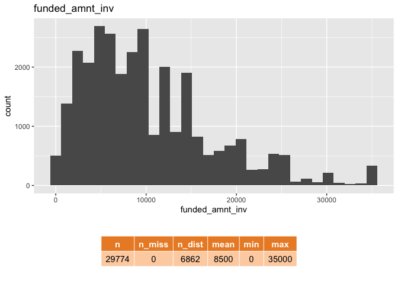<!-- --><!-- -->

    ## Warning: Removed 1 rows containing non-finite values (stat_bin).

<!-- --><!-- -->

    ## Warning: Removed 20 rows containing non-finite values (stat_bin).

<!-- --><!-- --><!-- -->

    ## Warning: Removed 20 rows containing non-finite values (stat_bin).

<!-- -->

    ## Warning: Removed 18904 rows containing non-finite values (stat_bin).

<!-- -->

    ## Warning: Removed 27205 rows containing non-finite values (stat_bin).

<!-- -->

    ## Warning: Removed 20 rows containing non-finite values (stat_bin).

<!-- -->

    ## Warning: Removed 20 rows containing non-finite values (stat_bin).

<!-- --><!-- -->

    ## Warning: Removed 64 rows containing non-finite values (stat_bin).

<!-- -->

    ## Warning: Removed 20 rows containing non-finite values (stat_bin).

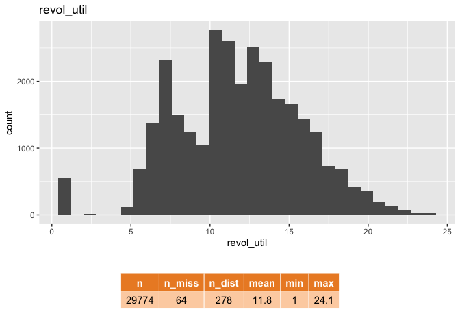<!-- --><!-- --><!-- --><!-- --><!-- -->

    ## Warning: Removed 101 rows containing non-finite values (stat_bin).

<!-- --><!-- -->

    ## Warning: Removed 20 rows containing non-finite values (stat_bin).

<!-- -->

    ## Warning: Removed 101 rows containing non-finite values (stat_bin).

<!-- -->

    ## Warning: Removed 20 rows containing non-finite values (stat_bin).

<!-- -->

    ## Warning: Removed 963 rows containing non-finite values (stat_bin).

<!-- -->

    ## Warning: Removed 76 rows containing non-finite values (stat_bin).

<!-- --><!-- -->

## Correlation between varibles

``` r
library(reshape2)
```

    ## 
    ## Attaching package: 'reshape2'

    ## The following object is masked from 'package:tidyr':
    ## 
    ##     smiths

``` r
loan_numeric <- subset(loan,select = -c(id,member_id)) %>%
  select_if(.,is.numeric)

cor_mat <- loan_numeric %>%
  cor()
```

    ## Warning in cor(.): the standard deviation is zero

``` r
# 2. Melt the Matrix 
cor_melt <- cor_mat %>% melt 

# 3. Visualize 
cor_melt %>%
  mutate(value = round(value,2)) %>%
 ggplot(aes(Var2, Var1, fill = value))+
 geom_tile() +
 scale_fill_gradient2(low = "blue", high = "red", mid = "white", 
                      midpoint = 0, limit = c(-1,1), space = "Lab", 
                      name="Correlation") +
 theme_minimal() +
 theme(axis.text.x = element_text(angle = 45, vjust = 1, 
                                  size = 4, hjust = 1),axis.text.y = element_text(angle = 45, vjust = 1, 
                                  size = 4, hjust = 1))+
 coord_fixed() +
 geom_text(aes(Var2, Var1, label = value), color = "black", size = 1.5) +
  labs(title = "Pearson Correlation for Numerical Data")
```

    ## Warning: Removed 656 rows containing missing values (geom_text).

<!-- -->

``` r
loan_numeric %>%
  ggplot(aes(x=int_rate,y=fico_range_high,color=loan$loan_status)) + geom_point() + labs(title = "int_rate vs fico_range_high")
```

<!-- -->

``` r
loan_numeric %>%
  ggplot(aes(x=last_pymnt_amnt,y=fico_range_low,color=loan$loan_status)) + geom_point() + labs(title = "last_pymnt_amnt vs fico_range_low")
```

<!-- -->

## Correlation with target

``` r
loan_vis <- loan %>%
  mutate_if(is.character,as.factor) %>%
  dplyr::select(!c(id,member_id,emp_title,issue_d,url,desc,title,zip_code,earliest_cr_line,last_pymnt_d,next_pymnt_d,last_credit_pull_d))

for (c in names(loan_vis)) {
  if (c %in% names(loan_vis %>% dplyr::select(where(is.factor)))) {
    # -- for each character column create a chart
    print( loan_vis %>%
             ggplot(., aes(!!as.name(c))) + 
             geom_bar(aes(fill = loan_status), position = "fill")  + labs(title = c, y = "pct default"))
  } else {
    # -- comparative boxplots
    print(ggplot(loan_vis, aes(x=loan_status, y=!!as.name(c), fill=loan_status))+ geom_boxplot() +labs(title = c))
  }
}
```

<!-- --><!-- --><!-- -->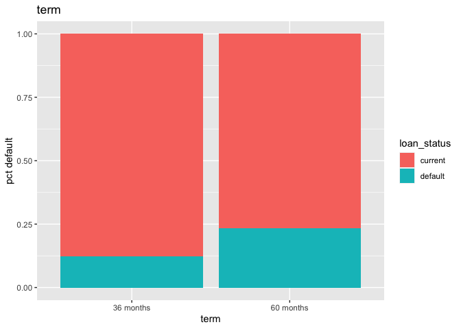<!-- --><!-- --><!-- --><!-- --><!-- -->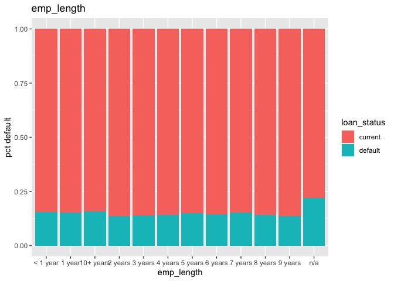<!-- --><!-- -->

    ## Warning: Removed 1 rows containing non-finite values (stat_boxplot).

<!-- --><!-- --><!-- --><!-- --><!-- --><!-- --><!-- -->

    ## Warning: Removed 20 rows containing non-finite values (stat_boxplot).

<!-- --><!-- --><!-- -->

    ## Warning: Removed 20 rows containing non-finite values (stat_boxplot).

<!-- -->

    ## Warning: Removed 18904 rows containing non-finite values (stat_boxplot).

<!-- -->

    ## Warning: Removed 27205 rows containing non-finite values (stat_boxplot).

<!-- -->

    ## Warning: Removed 20 rows containing non-finite values (stat_boxplot).

<!-- -->

    ## Warning: Removed 20 rows containing non-finite values (stat_boxplot).

<!-- --><!-- -->

    ## Warning: Removed 64 rows containing non-finite values (stat_boxplot).

<!-- -->

    ## Warning: Removed 20 rows containing non-finite values (stat_boxplot).

<!-- --><!-- --><!-- --><!-- --><!-- -->

    ## Warning: Removed 101 rows containing non-finite values (stat_boxplot).

<!-- -->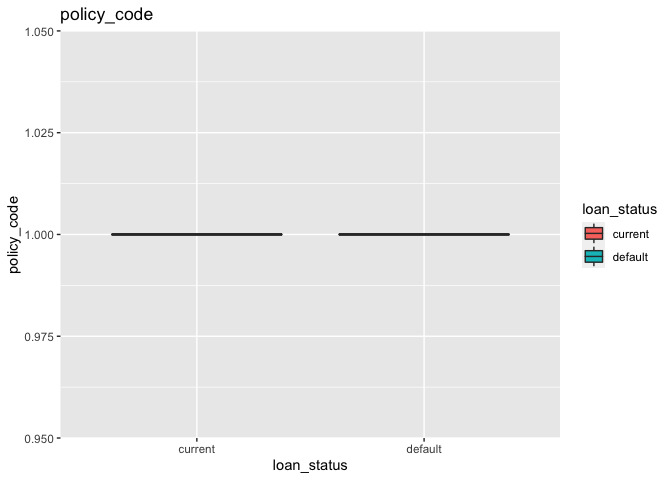<!-- --><!-- -->

    ## Warning: Removed 20 rows containing non-finite values (stat_boxplot).

<!-- -->

    ## Warning: Removed 101 rows containing non-finite values (stat_boxplot).

<!-- -->

    ## Warning: Removed 20 rows containing non-finite values (stat_boxplot).

<!-- -->

    ## Warning: Removed 963 rows containing non-finite values (stat_boxplot).

<!-- -->

    ## Warning: Removed 76 rows containing non-finite values (stat_boxplot).

<!-- -->

``` r
loan_vis %>%
             ggplot(., aes(term)) + 
             geom_bar(aes(fill = loan_status), position = "fill")  + labs(title = "Higher Number of Loan Payment Increases Loan Default Rate", y = "pct default")+geom_hline(yintercept=0.15, linetype="solid", color = "blue")
```

<!-- -->

``` r
#int_rate <  14 & funded_amnt <  20163 & emp_length_X7.years >= 0.5  
h_point <- loan %>%
  #sample_n(15210) %>%
  filter((int_rate <  14) & (funded_amnt >=  20163) & (emp_length != "7 years") ) 

set.seed(512)
ggplot(loan,aes(x=int_rate,y=funded_amnt)) +
  geom_point() +
  geom_hline(yintercept=20163, linetype="solid", color = "red")+
  geom_vline(xintercept=14, linetype="solid", color = "red") +
  geom_point(data=h_point,
             aes(x=int_rate,y=funded_amnt, color="red"),size=3)
```

<!-- -->

# Recipe

``` r
# deal w. categoricals 
loan_recipe <- recipe(~.,loan) %>%
  step_rm(id,member_id,emp_title,issue_d,url,desc,title,zip_code,earliest_cr_line,last_pymnt_d,next_pymnt_d,last_credit_pull_d) %>%
  step_unknown(all_nominal_predictors()) %>%
  step_novel(all_nominal_predictors()) %>%
  step_impute_median(all_numeric_predictors()) %>%
  step_dummy(all_nominal_predictors()) %>%
  step_impute_median(all_numeric()) %>%
  prep()

bake_loan <- bake(loan_recipe, loan)

# just numeric data 
loan_numeric <- loan %>% select_if(is.numeric)

loan_recipe <- recipe(~.,loan_numeric) %>%
  step_rm(id,member_id) %>%
  # update_role(employee_number, new_role = "ignore") %>%
  step_impute_median(all_numeric()) %>%
  prep()

#bake_loan <- bake(loan_recipe, loan_numeric)
```

## Train your IsolationForest

``` r
set.seed(512)
iso_forest <- isolationForest$new(
  sample_size = 521,
  num_trees = 100,
  max_depth = 12)


iso_forest$fit(bake_loan)
```

    ## INFO  [17:32:14.586] Building Isolation Forest ...
    ## INFO  [17:32:15.789] done
    ## INFO  [17:32:15.797] Computing depth of terminal nodes ...
    ## INFO  [17:32:16.500] done
    ## INFO  [17:32:19.270] Completed growing isolation forest

# predict training

evaluate histogram pick a value of average_depth to identify anomalies.
a shorter average depth means the point is more isolated and more likely
an anomaly

``` r
pred_train <- iso_forest$predict(bake_loan)

#sumarize
pred_train %>%
  summarise(n=n(),
            min = min(average_depth),
            max = max(average_depth),
            mean = mean(average_depth),
            min_score =  min(anomaly_score),
            max_score = max(anomaly_score),
            mean_score= mean(anomaly_score),
    
  )
```

    ##       n  min max     mean min_score max_score mean_score
    ## 1 29774 9.59  12 11.36685 0.4901732 0.5656368  0.5090431

``` r
pred_train %>%
  ggplot(aes(average_depth)) +
  geom_histogram(bins=20) + 
  geom_vline(xintercept = 11.36685, linetype="dotted", 
                color = "blue", size=1.5) + 
  labs(title="Isolation Forest Average Tree Depth")
```

<!-- -->

``` r
pred_train %>%
  ggplot(aes(anomaly_score)) +
  geom_histogram(bins=20) + 
  geom_vline(xintercept = 0.5090431, linetype="dotted", 
                color = "blue", size=1.5) + 
  labs(title="Isolation Forest Anomaly Score Above 0.51")
```

<!-- -->

# global level interpretation

The steps of interpreting anomalies on a global level are:

1.  Create a data frame with a column that indicates whether the record
    was considered an anomaly.
2.  Train a decision tree to predict the anomaly flag.
3.  Visualize the decision tree to determine which segments of the data
    are considered anomalous.

``` r
train_pred <- bind_cols(iso_forest$predict(bake_loan),bake_loan) %>%
  mutate(anomaly = as.factor(if_else(average_depth <= 11.36685, "Anomaly","Normal")))

train_pred %>%
  arrange(average_depth) %>%
  count(anomaly)
```

    ##    anomaly     n
    ## 1: Anomaly 13306
    ## 2:  Normal 16468

``` r
head(train_pred,10)
```

    ##     id average_depth anomaly_score loan_amnt funded_amnt funded_amnt_inv
    ##  1:  1         11.45     0.5064562      5000        5000            4975
    ##  2:  2         11.27     0.5119018      2500        2500            2500
    ##  3:  3         11.61     0.5016643     10000       10000           10000
    ##  4:  4         11.43     0.5070584      7000        7000            7000
    ##  5:  5         11.43     0.5070584      3000        3000            3000
    ##  6:  6         11.16     0.5152584      5600        5600            5600
    ##  7:  7         11.45     0.5064562      6500        6500            6500
    ##  8:  8         11.76     0.4972131     12000       12000           12000
    ##  9:  9         11.13     0.5161777      3000        3000            3000
    ## 10: 10         11.50     0.5049538     10000       10000           10000
    ##     int_rate installment annual_inc   dti delinq_2yrs fico_range_low
    ##  1:    10.65      162.87      24000 27.65           0            735
    ##  2:    15.27       59.83      30000  1.00           0            740
    ##  3:    13.49      339.31      49200 20.00           0            690
    ##  4:    15.96      170.08      47004 23.51           0            690
    ##  5:    18.64      109.43      48000  5.35           0            660
    ##  6:    21.28      152.39      40000  5.55           0            675
    ##  7:    14.65      153.45      72000 16.12           0            695
    ##  8:    12.69      402.54      75000 10.78           0            675
    ##  9:     9.91       96.68      15000 12.56           0            705
    ## 10:    10.65      325.74     100000  7.06           0            720
    ##     fico_range_high inq_last_6mths mths_since_last_delinq
    ##  1:             739              1                     32
    ##  2:             744              5                     32
    ##  3:             694              1                     35
    ##  4:             694              1                     32
    ##  5:             664              2                     32
    ##  6:             679              2                     32
    ##  7:             699              2                     32
    ##  8:             679              0                     32
    ##  9:             709              2                     32
    ## 10:             724              2                     32
    ##     mths_since_last_record open_acc pub_rec revol_bal revol_util total_acc
    ##  1:                     85        3       0     13648      10.60         9
    ##  2:                     85        3       0      1687      15.00         4
    ##  3:                     85       10       0      5598      13.00        37
    ##  4:                     85        7       0     17726      15.90        11
    ##  5:                     85        4       0      8221      18.60         4
    ##  6:                     85       11       0      5210      21.20        13
    ##  7:                     85       14       0      4032      14.60        23
    ##  8:                     85       12       0     23336      12.60        34
    ##  9:                     85       11       0      7323       9.91        11
    ## 10:                     85       14       0     11997      10.60        29
    ##     out_prncp out_prncp_inv total_rec_late_fee last_pymnt_amnt
    ##  1:         0             0               0.00          171.62
    ##  2:         0             0               0.00          119.66
    ##  3:         0             0              16.97          357.48
    ##  4:         0             0               0.00         1313.76
    ##  5:         0             0               0.00          111.34
    ##  6:         0             0               0.00          152.39
    ##  7:         0             0               0.00         1655.54
    ##  8:         0             0               0.00         6315.30
    ##  9:         0             0               0.00          102.43
    ## 10:         0             0               0.00          325.74
    ##     collections_12_mths_ex_med policy_code acc_now_delinq
    ##  1:                          0           1              0
    ##  2:                          0           1              0
    ##  3:                          0           1              0
    ##  4:                          0           1              0
    ##  5:                          0           1              0
    ##  6:                          0           1              0
    ##  7:                          0           1              0
    ##  8:                          0           1              0
    ##  9:                          0           1              0
    ## 10:                          0           1              0
    ##     chargeoff_within_12_mths delinq_amnt pub_rec_bankruptcies tax_liens
    ##  1:                        0           0                    0         0
    ##  2:                        0           0                    0         0
    ##  3:                        0           0                    0         0
    ##  4:                        0           0                    0         0
    ##  5:                        0           0                    0         0
    ##  6:                        0           0                    0         0
    ##  7:                        0           0                    0         0
    ##  8:                        0           0                    0         0
    ##  9:                        0           0                    0         0
    ## 10:                        0           0                    0         0
    ##     term_X60.months term_unknown term_new grade_B grade_C grade_D grade_E
    ##  1:               0            0        0       1       0       0       0
    ##  2:               1            0        0       0       1       0       0
    ##  3:               0            0        0       0       1       0       0
    ##  4:               1            0        0       0       1       0       0
    ##  5:               0            0        0       0       0       0       1
    ##  6:               1            0        0       0       0       0       0
    ##  7:               1            0        0       0       1       0       0
    ##  8:               0            0        0       1       0       0       0
    ##  9:               0            0        0       1       0       0       0
    ## 10:               0            0        0       1       0       0       0
    ##     grade_F grade_G grade_unknown grade_new sub_grade_A2 sub_grade_A3
    ##  1:       0       0             0         0            0            0
    ##  2:       0       0             0         0            0            0
    ##  3:       0       0             0         0            0            0
    ##  4:       0       0             0         0            0            0
    ##  5:       0       0             0         0            0            0
    ##  6:       1       0             0         0            0            0
    ##  7:       0       0             0         0            0            0
    ##  8:       0       0             0         0            0            0
    ##  9:       0       0             0         0            0            0
    ## 10:       0       0             0         0            0            0
    ##     sub_grade_A4 sub_grade_A5 sub_grade_B1 sub_grade_B2 sub_grade_B3
    ##  1:            0            0            0            1            0
    ##  2:            0            0            0            0            0
    ##  3:            0            0            0            0            0
    ##  4:            0            0            0            0            0
    ##  5:            0            0            0            0            0
    ##  6:            0            0            0            0            0
    ##  7:            0            0            0            0            0
    ##  8:            0            0            0            0            0
    ##  9:            0            0            1            0            0
    ## 10:            0            0            0            1            0
    ##     sub_grade_B4 sub_grade_B5 sub_grade_C1 sub_grade_C2 sub_grade_C3
    ##  1:            0            0            0            0            0
    ##  2:            0            0            0            0            0
    ##  3:            0            0            1            0            0
    ##  4:            0            0            0            0            0
    ##  5:            0            0            0            0            0
    ##  6:            0            0            0            0            0
    ##  7:            0            0            0            0            1
    ##  8:            0            1            0            0            0
    ##  9:            0            0            0            0            0
    ## 10:            0            0            0            0            0
    ##     sub_grade_C4 sub_grade_C5 sub_grade_D1 sub_grade_D2 sub_grade_D3
    ##  1:            0            0            0            0            0
    ##  2:            1            0            0            0            0
    ##  3:            0            0            0            0            0
    ##  4:            0            1            0            0            0
    ##  5:            0            0            0            0            0
    ##  6:            0            0            0            0            0
    ##  7:            0            0            0            0            0
    ##  8:            0            0            0            0            0
    ##  9:            0            0            0            0            0
    ## 10:            0            0            0            0            0
    ##     sub_grade_D4 sub_grade_D5 sub_grade_E1 sub_grade_E2 sub_grade_E3
    ##  1:            0            0            0            0            0
    ##  2:            0            0            0            0            0
    ##  3:            0            0            0            0            0
    ##  4:            0            0            0            0            0
    ##  5:            0            0            1            0            0
    ##  6:            0            0            0            0            0
    ##  7:            0            0            0            0            0
    ##  8:            0            0            0            0            0
    ##  9:            0            0            0            0            0
    ## 10:            0            0            0            0            0
    ##     sub_grade_E4 sub_grade_E5 sub_grade_F1 sub_grade_F2 sub_grade_F3
    ##  1:            0            0            0            0            0
    ##  2:            0            0            0            0            0
    ##  3:            0            0            0            0            0
    ##  4:            0            0            0            0            0
    ##  5:            0            0            0            0            0
    ##  6:            0            0            0            1            0
    ##  7:            0            0            0            0            0
    ##  8:            0            0            0            0            0
    ##  9:            0            0            0            0            0
    ## 10:            0            0            0            0            0
    ##     sub_grade_F4 sub_grade_F5 sub_grade_G1 sub_grade_G2 sub_grade_G3
    ##  1:            0            0            0            0            0
    ##  2:            0            0            0            0            0
    ##  3:            0            0            0            0            0
    ##  4:            0            0            0            0            0
    ##  5:            0            0            0            0            0
    ##  6:            0            0            0            0            0
    ##  7:            0            0            0            0            0
    ##  8:            0            0            0            0            0
    ##  9:            0            0            0            0            0
    ## 10:            0            0            0            0            0
    ##     sub_grade_G4 sub_grade_G5 sub_grade_unknown sub_grade_new
    ##  1:            0            0                 0             0
    ##  2:            0            0                 0             0
    ##  3:            0            0                 0             0
    ##  4:            0            0                 0             0
    ##  5:            0            0                 0             0
    ##  6:            0            0                 0             0
    ##  7:            0            0                 0             0
    ##  8:            0            0                 0             0
    ##  9:            0            0                 0             0
    ## 10:            0            0                 0             0
    ##     emp_length_X1.year emp_length_X10..years emp_length_X2.years
    ##  1:                  0                     1                   0
    ##  2:                  0                     0                   0
    ##  3:                  0                     1                   0
    ##  4:                  0                     0                   0
    ##  5:                  0                     0                   0
    ##  6:                  0                     0                   0
    ##  7:                  0                     0                   0
    ##  8:                  0                     1                   0
    ##  9:                  0                     0                   0
    ## 10:                  0                     0                   0
    ##     emp_length_X3.years emp_length_X4.years emp_length_X5.years
    ##  1:                   0                   0                   0
    ##  2:                   0                   0                   0
    ##  3:                   0                   0                   0
    ##  4:                   0                   0                   0
    ##  5:                   0                   0                   0
    ##  6:                   0                   1                   0
    ##  7:                   0                   0                   1
    ##  8:                   0                   0                   0
    ##  9:                   1                   0                   0
    ## 10:                   1                   0                   0
    ##     emp_length_X6.years emp_length_X7.years emp_length_X8.years
    ##  1:                   0                   0                   0
    ##  2:                   0                   0                   0
    ##  3:                   0                   0                   0
    ##  4:                   0                   0                   1
    ##  5:                   0                   0                   0
    ##  6:                   0                   0                   0
    ##  7:                   0                   0                   0
    ##  8:                   0                   0                   0
    ##  9:                   0                   0                   0
    ## 10:                   0                   0                   0
    ##     emp_length_X9.years emp_length_n.a emp_length_unknown emp_length_new
    ##  1:                   0              0                  0              0
    ##  2:                   0              0                  0              0
    ##  3:                   0              0                  0              0
    ##  4:                   0              0                  0              0
    ##  5:                   1              0                  0              0
    ##  6:                   0              0                  0              0
    ##  7:                   0              0                  0              0
    ##  8:                   0              0                  0              0
    ##  9:                   0              0                  0              0
    ## 10:                   0              0                  0              0
    ##     home_ownership_NONE home_ownership_OTHER home_ownership_OWN
    ##  1:                   0                    0                  0
    ##  2:                   0                    0                  0
    ##  3:                   0                    0                  0
    ##  4:                   0                    0                  0
    ##  5:                   0                    0                  0
    ##  6:                   0                    0                  1
    ##  7:                   0                    0                  1
    ##  8:                   0                    0                  1
    ##  9:                   0                    0                  0
    ## 10:                   0                    0                  0
    ##     home_ownership_RENT home_ownership_unknown home_ownership_new
    ##  1:                   1                      0                  0
    ##  2:                   1                      0                  0
    ##  3:                   1                      0                  0
    ##  4:                   1                      0                  0
    ##  5:                   1                      0                  0
    ##  6:                   0                      0                  0
    ##  7:                   0                      0                  0
    ##  8:                   0                      0                  0
    ##  9:                   1                      0                  0
    ## 10:                   1                      0                  0
    ##     verification_status_Source.Verified verification_status_Verified
    ##  1:                                   0                            1
    ##  2:                                   1                            0
    ##  3:                                   1                            0
    ##  4:                                   0                            0
    ##  5:                                   1                            0
    ##  6:                                   1                            0
    ##  7:                                   0                            0
    ##  8:                                   1                            0
    ##  9:                                   1                            0
    ## 10:                                   1                            0
    ##     verification_status_unknown verification_status_new loan_status_default
    ##  1:                           0                       0                   0
    ##  2:                           0                       0                   1
    ##  3:                           0                       0                   0
    ##  4:                           0                       0                   0
    ##  5:                           0                       0                   0
    ##  6:                           0                       0                   1
    ##  7:                           0                       0                   0
    ##  8:                           0                       0                   0
    ##  9:                           0                       0                   0
    ## 10:                           0                       0                   1
    ##     loan_status_unknown loan_status_new pymnt_plan_y pymnt_plan_unknown
    ##  1:                   0               0            0                  0
    ##  2:                   0               0            0                  0
    ##  3:                   0               0            0                  0
    ##  4:                   0               0            0                  0
    ##  5:                   0               0            0                  0
    ##  6:                   0               0            0                  0
    ##  7:                   0               0            0                  0
    ##  8:                   0               0            0                  0
    ##  9:                   0               0            0                  0
    ## 10:                   0               0            0                  0
    ##     pymnt_plan_new purpose_credit_card purpose_debt_consolidation
    ##  1:              0                   1                          0
    ##  2:              0                   0                          0
    ##  3:              0                   0                          0
    ##  4:              0                   0                          1
    ##  5:              0                   0                          0
    ##  6:              0                   0                          0
    ##  7:              0                   0                          1
    ##  8:              0                   0                          1
    ##  9:              0                   1                          0
    ## 10:              0                   0                          0
    ##     purpose_educational purpose_home_improvement purpose_house
    ##  1:                   0                        0             0
    ##  2:                   0                        0             0
    ##  3:                   0                        0             0
    ##  4:                   0                        0             0
    ##  5:                   0                        0             0
    ##  6:                   0                        0             0
    ##  7:                   0                        0             0
    ##  8:                   0                        0             0
    ##  9:                   0                        0             0
    ## 10:                   0                        0             0
    ##     purpose_major_purchase purpose_medical purpose_moving purpose_other
    ##  1:                      0               0              0             0
    ##  2:                      0               0              0             0
    ##  3:                      0               0              0             1
    ##  4:                      0               0              0             0
    ##  5:                      0               0              0             0
    ##  6:                      0               0              0             0
    ##  7:                      0               0              0             0
    ##  8:                      0               0              0             0
    ##  9:                      0               0              0             0
    ## 10:                      0               0              0             1
    ##     purpose_renewable_energy purpose_small_business purpose_vacation
    ##  1:                        0                      0                0
    ##  2:                        0                      0                0
    ##  3:                        0                      0                0
    ##  4:                        0                      0                0
    ##  5:                        0                      0                0
    ##  6:                        0                      1                0
    ##  7:                        0                      0                0
    ##  8:                        0                      0                0
    ##  9:                        0                      0                0
    ## 10:                        0                      0                0
    ##     purpose_wedding purpose_unknown purpose_new addr_state_AL addr_state_AR
    ##  1:               0               0           0             0             0
    ##  2:               0               0           0             0             0
    ##  3:               0               0           0             0             0
    ##  4:               0               0           0             0             0
    ##  5:               0               0           0             0             0
    ##  6:               0               0           0             0             0
    ##  7:               0               0           0             0             0
    ##  8:               0               0           0             0             0
    ##  9:               0               0           0             0             0
    ## 10:               0               0           0             0             0
    ##     addr_state_AZ addr_state_CA addr_state_CO addr_state_CT addr_state_DC
    ##  1:             1             0             0             0             0
    ##  2:             0             0             0             0             0
    ##  3:             0             1             0             0             0
    ##  4:             0             0             0             0             0
    ##  5:             0             1             0             0             0
    ##  6:             0             1             0             0             0
    ##  7:             1             0             0             0             0
    ##  8:             0             1             0             0             0
    ##  9:             0             0             0             0             0
    ## 10:             0             1             0             0             0
    ##     addr_state_DE addr_state_FL addr_state_GA addr_state_HI addr_state_IA
    ##  1:             0             0             0             0             0
    ##  2:             0             0             1             0             0
    ##  3:             0             0             0             0             0
    ##  4:             0             0             0             0             0
    ##  5:             0             0             0             0             0
    ##  6:             0             0             0             0             0
    ##  7:             0             0             0             0             0
    ##  8:             0             0             0             0             0
    ##  9:             0             0             0             0             0
    ## 10:             0             0             0             0             0
    ##     addr_state_ID addr_state_IL addr_state_IN addr_state_KS addr_state_KY
    ##  1:             0             0             0             0             0
    ##  2:             0             0             0             0             0
    ##  3:             0             0             0             0             0
    ##  4:             0             0             0             0             0
    ##  5:             0             0             0             0             0
    ##  6:             0             0             0             0             0
    ##  7:             0             0             0             0             0
    ##  8:             0             0             0             0             0
    ##  9:             0             1             0             0             0
    ## 10:             0             0             0             0             0
    ##     addr_state_LA addr_state_MA addr_state_MD addr_state_ME addr_state_MI
    ##  1:             0             0             0             0             0
    ##  2:             0             0             0             0             0
    ##  3:             0             0             0             0             0
    ##  4:             0             0             0             0             0
    ##  5:             0             0             0             0             0
    ##  6:             0             0             0             0             0
    ##  7:             0             0             0             0             0
    ##  8:             0             0             0             0             0
    ##  9:             0             0             0             0             0
    ## 10:             0             0             0             0             0
    ##     addr_state_MN addr_state_MO addr_state_MS addr_state_MT addr_state_NC
    ##  1:             0             0             0             0             0
    ##  2:             0             0             0             0             0
    ##  3:             0             0             0             0             0
    ##  4:             0             0             0             0             1
    ##  5:             0             0             0             0             0
    ##  6:             0             0             0             0             0
    ##  7:             0             0             0             0             0
    ##  8:             0             0             0             0             0
    ##  9:             0             0             0             0             0
    ## 10:             0             0             0             0             0
    ##     addr_state_NE addr_state_NH addr_state_NJ addr_state_NM addr_state_NV
    ##  1:             0             0             0             0             0
    ##  2:             0             0             0             0             0
    ##  3:             0             0             0             0             0
    ##  4:             0             0             0             0             0
    ##  5:             0             0             0             0             0
    ##  6:             0             0             0             0             0
    ##  7:             0             0             0             0             0
    ##  8:             0             0             0             0             0
    ##  9:             0             0             0             0             0
    ## 10:             0             0             0             0             0
    ##     addr_state_NY addr_state_OH addr_state_OK addr_state_OR addr_state_PA
    ##  1:             0             0             0             0             0
    ##  2:             0             0             0             0             0
    ##  3:             0             0             0             0             0
    ##  4:             0             0             0             0             0
    ##  5:             0             0             0             0             0
    ##  6:             0             0             0             0             0
    ##  7:             0             0             0             0             0
    ##  8:             0             0             0             0             0
    ##  9:             0             0             0             0             0
    ## 10:             0             0             0             0             0
    ##     addr_state_RI addr_state_SC addr_state_SD addr_state_TN addr_state_TX
    ##  1:             0             0             0             0             0
    ##  2:             0             0             0             0             0
    ##  3:             0             0             0             0             0
    ##  4:             0             0             0             0             0
    ##  5:             0             0             0             0             0
    ##  6:             0             0             0             0             0
    ##  7:             0             0             0             0             0
    ##  8:             0             0             0             0             0
    ##  9:             0             0             0             0             0
    ## 10:             0             0             0             0             0
    ##     addr_state_UT addr_state_VA addr_state_VT addr_state_WA addr_state_WI
    ##  1:             0             0             0             0             0
    ##  2:             0             0             0             0             0
    ##  3:             0             0             0             0             0
    ##  4:             0             0             0             0             0
    ##  5:             0             0             0             0             0
    ##  6:             0             0             0             0             0
    ##  7:             0             0             0             0             0
    ##  8:             0             0             0             0             0
    ##  9:             0             0             0             0             0
    ## 10:             0             0             0             0             0
    ##     addr_state_WV addr_state_WY addr_state_unknown addr_state_new
    ##  1:             0             0                  0              0
    ##  2:             0             0                  0              0
    ##  3:             0             0                  0              0
    ##  4:             0             0                  0              0
    ##  5:             0             0                  0              0
    ##  6:             0             0                  0              0
    ##  7:             0             0                  0              0
    ##  8:             0             0                  0              0
    ##  9:             0             0                  0              0
    ## 10:             0             0                  0              0
    ##     application_type_unknown application_type_new anomaly
    ##  1:                        0                    0  Normal
    ##  2:                        0                    0 Anomaly
    ##  3:                        0                    0  Normal
    ##  4:                        0                    0  Normal
    ##  5:                        0                    0  Normal
    ##  6:                        0                    0 Anomaly
    ##  7:                        0                    0  Normal
    ##  8:                        0                    0  Normal
    ##  9:                        0                    0 Anomaly
    ## 10:                        0                    0  Normal

## Fit a Tree

``` r
fmla <- as.formula(paste("anomaly ~ ", paste(bake_loan %>% colnames(), collapse= "+")))

outlier_tree <- decision_tree(min_n=2, tree_depth=3, cost_complexity = .01) %>%
  set_mode("classification") %>%
  set_engine("rpart") %>%
  fit(fmla, data=train_pred)

outlier_tree$fit
```

    ## n= 29774 
    ## 
    ## node), split, n, loss, yval, (yprob)
    ##       * denotes terminal node
    ## 
    ##  1) root 29774 13306 Normal (0.4469000 0.5531000)  
    ##    2) int_rate>=13.925 9357  3428 Anomaly (0.6336433 0.3663567) *
    ##    3) int_rate< 13.925 20417  7377 Normal (0.3613165 0.6386835)  
    ##      6) funded_amnt>=20162.5 1381   335 Anomaly (0.7574222 0.2425778) *
    ##      7) funded_amnt< 20162.5 19036  6331 Normal (0.3325804 0.6674196)  
    ##       14) emp_length_X7.years>=0.5 818   176 Anomaly (0.7848411 0.2151589) *
    ##       15) emp_length_X7.years< 0.5 18218  5689 Normal (0.3122736 0.6877264) *

``` r
library(rpart.plot) # -- plotting decision trees 
```

    ## Loading required package: rpart

    ## 
    ## Attaching package: 'rpart'

    ## The following object is masked from 'package:dials':
    ## 
    ##     prune

``` r
rpart.plot(outlier_tree$fit,clip.right.labs = FALSE, branch = .3, under = TRUE, roundint=FALSE, extra=3)
```

<!-- --> \#
Global Anomaly Rules

``` r
anomaly_rules <- rpart.rules(outlier_tree$fit,roundint=FALSE, extra = 5, cover = TRUE, clip.facs = TRUE) %>% clean_names() %>%
  #filter(anomaly=="Anomaly") %>%
  mutate(rule = "IF") 


rule_cols <- anomaly_rules %>% dplyr::select(starts_with("x_")) %>% colnames()

for (col in rule_cols){
anomaly_rules <- anomaly_rules %>%
    mutate(rule = paste(rule, !!as.name(col)))
}

anomaly_rules %>%
  as.data.frame() %>%
  filter(anomaly == "Anomaly") %>%
  mutate(rule = paste(rule, " THEN ", anomaly )) %>%
  mutate(rule = paste(rule," coverage ", cover)) %>%
  dplyr::select( rule)
```

    ##                                                                                                   rule
    ## 14 IF int_rate <  14 & funded_amnt <  20163 & emp_length_X7.years >= 0.5  THEN  Anomaly  coverage   3%
    ## 6                           IF int_rate <  14 & funded_amnt >= 20163      THEN  Anomaly  coverage   5%
    ## 2                                              IF int_rate >= 14          THEN  Anomaly  coverage  31%

``` r
anomaly_rules %>%
  as.data.frame() %>%
  filter(anomaly == "Normal") %>%
  mutate(rule = paste(rule, " THEN ", anomaly )) %>%
  mutate(rule = paste(rule," coverage ", cover)) %>%
  dplyr::select( rule)
```

    ##                                                                                                  rule
    ## 15 IF int_rate <  14 & funded_amnt <  20163 & emp_length_X7.years <  0.5  THEN  Normal  coverage  61%

``` r
pred_train <- bind_cols(iso_forest$predict(bake_loan),
                        bake_loan)


pred_train %>%
  arrange(desc(anomaly_score)) %>%
  filter(average_depth <= 11.36685)
```

    ##           id average_depth anomaly_score loan_amnt funded_amnt  funded_amnt_inv
    ##     1:  2745          9.59     0.5656368     35000       35000 34750.0000000000
    ##     2: 28443          9.61     0.5649651     24000       24000 22450.0000000000
    ##     3:  2658          9.69     0.5622860     35000       35000 34977.3467431980
    ##     4:  4257          9.69     0.5622860     35000       35000 34875.0000000000
    ##     5: 29559          9.72     0.5612846     25000       25000  1999.9998357226
    ##    ---                                                                         
    ## 13302: 29018         11.36     0.5091717      2500        1250     0.0008996973
    ## 13303: 29047         11.36     0.5091717      2400        2400   320.8685496885
    ## 13304: 29055         11.36     0.5091717      5500        5500   710.2338093182
    ## 13305: 29243         11.36     0.5091717     10000       10000  7870.7541876052
    ## 13306: 29366         11.36     0.5091717     18500       18500  6650.0000000000
    ##        int_rate installment annual_inc   dti delinq_2yrs fico_range_low
    ##     1:    19.03      908.50     400000  6.16           1            705
    ##     2:    14.96      831.52     350000 11.38           0            715
    ##     3:    21.67      960.11     250000 14.25           2            675
    ##     4:    22.35      973.64     340000  3.60           4            665
    ##     5:    15.01      866.76     185000 24.59           0            695
    ##    ---                                                                 
    ## 13302:    13.49       42.42      18000  4.67           0            650
    ## 13303:    13.55       81.51      26160 22.94           0            660
    ## 13304:    11.66      181.79      20004  9.90           0            675
    ## 13305:    12.61      335.07      35280 20.10           0            685
    ## 13306:    15.45      645.40      70346 28.78           0            715
    ##        fico_range_high inq_last_6mths mths_since_last_delinq
    ##     1:             709              1                     23
    ##     2:             719              7                     32
    ##     3:             679              0                     10
    ##     4:             669              0                     22
    ##     5:             699              7                      0
    ##    ---                                                      
    ## 13302:             654              1                     32
    ## 13303:             664              4                     32
    ## 13304:             679              4                     32
    ## 13305:             689              6                     32
    ## 13306:             719              1                      0
    ##        mths_since_last_record open_acc pub_rec revol_bal revol_util total_acc
    ##     1:                     85       18       0     58644      19.00        58
    ##     2:                     85       13       0   1207359      14.00        33
    ##     3:                     85       12       0     79792      21.60        25
    ##     4:                     85       15       0     21567      22.30        62
    ##     5:                      0       24       0    245886      15.00        51
    ##    ---                                                                       
    ## 13302:                     85        4       0      1157       1.00         4
    ## 13303:                     85        4       0       558      13.50         4
    ## 13304:                     85        5       0      5111      11.66         6
    ## 13305:                     85        7       0      3590      12.60        10
    ## 13306:                      0       17       0     69744      15.40        31
    ##        out_prncp out_prncp_inv total_rec_late_fee last_pymnt_amnt
    ##     1:         0             0                  0          391.38
    ##     2:         0             0                  0          831.52
    ##     3:         0             0                  0        29063.76
    ##     4:         0             0                  0         8179.64
    ##     5:         0             0                  0          866.76
    ##    ---                                                           
    ## 13302:         0             0                 45           50.00
    ## 13303:         0             0                  0           81.49
    ## 13304:         0             0                  0          182.28
    ## 13305:         0             0                  0          364.76
    ## 13306:         0             0                  0        11057.88
    ##        collections_12_mths_ex_med policy_code acc_now_delinq
    ##     1:                          0           1              0
    ##     2:                          0           1              0
    ##     3:                          0           1              0
    ##     4:                          0           1              0
    ##     5:                          0           1              0
    ##    ---                                                      
    ## 13302:                          0           1              0
    ## 13303:                          0           1              0
    ## 13304:                          0           1              0
    ## 13305:                          0           1              0
    ## 13306:                          0           1              0
    ##        chargeoff_within_12_mths delinq_amnt pub_rec_bankruptcies tax_liens
    ##     1:                        0           0                    0         0
    ##     2:                        0           0                    0         0
    ##     3:                        0           0                    0         0
    ##     4:                        0           0                    0         0
    ##     5:                        0           0                    0         0
    ##    ---                                                                    
    ## 13302:                        0           0                    0         0
    ## 13303:                        0           0                    0         0
    ## 13304:                        0           0                    0         0
    ## 13305:                        0           0                    0         0
    ## 13306:                        0           0                    0         0
    ##        term_X60.months term_unknown term_new grade_B grade_C grade_D grade_E
    ##     1:               1            0        0       0       0       0       1
    ##     2:               0            0        0       0       0       1       0
    ##     3:               1            0        0       0       0       0       0
    ##     4:               1            0        0       0       0       0       0
    ##     5:               0            0        0       0       0       0       0
    ##    ---                                                                      
    ## 13302:               0            0        0       0       0       1       0
    ## 13303:               0            0        0       0       0       1       0
    ## 13304:               0            0        0       0       1       0       0
    ## 13305:               0            0        0       0       0       1       0
    ## 13306:               0            0        0       0       0       0       1
    ##        grade_F grade_G grade_unknown grade_new sub_grade_A2 sub_grade_A3
    ##     1:       0       0             0         0            0            0
    ##     2:       0       0             0         0            0            0
    ##     3:       1       0             0         0            0            0
    ##     4:       1       0             0         0            0            0
    ##     5:       1       0             0         0            0            0
    ##    ---                                                                  
    ## 13302:       0       0             0         0            0            0
    ## 13303:       0       0             0         0            0            0
    ## 13304:       0       0             0         0            0            0
    ## 13305:       0       0             0         0            0            0
    ## 13306:       0       0             0         0            0            0
    ##        sub_grade_A4 sub_grade_A5 sub_grade_B1 sub_grade_B2 sub_grade_B3
    ##     1:            0            0            0            0            0
    ##     2:            0            0            0            0            0
    ##     3:            0            0            0            0            0
    ##     4:            0            0            0            0            0
    ##     5:            0            0            0            0            0
    ##    ---                                                                 
    ## 13302:            0            0            0            0            0
    ## 13303:            0            0            0            0            0
    ## 13304:            0            0            0            0            0
    ## 13305:            0            0            0            0            0
    ## 13306:            0            0            0            0            0
    ##        sub_grade_B4 sub_grade_B5 sub_grade_C1 sub_grade_C2 sub_grade_C3
    ##     1:            0            0            0            0            0
    ##     2:            0            0            0            0            0
    ##     3:            0            0            0            0            0
    ##     4:            0            0            0            0            0
    ##     5:            0            0            0            0            0
    ##    ---                                                                 
    ## 13302:            0            0            0            0            0
    ## 13303:            0            0            0            0            0
    ## 13304:            0            0            0            0            1
    ## 13305:            0            0            0            0            0
    ## 13306:            0            0            0            0            0
    ##        sub_grade_C4 sub_grade_C5 sub_grade_D1 sub_grade_D2 sub_grade_D3
    ##     1:            0            0            0            0            0
    ##     2:            0            0            0            1            0
    ##     3:            0            0            0            0            0
    ##     4:            0            0            0            0            0
    ##     5:            0            0            0            0            0
    ##    ---                                                                 
    ## 13302:            0            0            0            0            1
    ## 13303:            0            0            0            0            0
    ## 13304:            0            0            0            0            0
    ## 13305:            0            0            1            0            0
    ## 13306:            0            0            0            0            0
    ##        sub_grade_D4 sub_grade_D5 sub_grade_E1 sub_grade_E2 sub_grade_E3
    ##     1:            0            0            0            1            0
    ##     2:            0            0            0            0            0
    ##     3:            0            0            0            0            0
    ##     4:            0            0            0            0            0
    ##     5:            0            0            0            0            0
    ##    ---                                                                 
    ## 13302:            0            0            0            0            0
    ## 13303:            1            0            0            0            0
    ## 13304:            0            0            0            0            0
    ## 13305:            0            0            0            0            0
    ## 13306:            0            0            0            0            0
    ##        sub_grade_E4 sub_grade_E5 sub_grade_F1 sub_grade_F2 sub_grade_F3
    ##     1:            0            0            0            0            0
    ##     2:            0            0            0            0            0
    ##     3:            0            0            0            0            1
    ##     4:            0            0            0            0            0
    ##     5:            0            0            1            0            0
    ##    ---                                                                 
    ## 13302:            0            0            0            0            0
    ## 13303:            0            0            0            0            0
    ## 13304:            0            0            0            0            0
    ## 13305:            0            0            0            0            0
    ## 13306:            0            1            0            0            0
    ##        sub_grade_F4 sub_grade_F5 sub_grade_G1 sub_grade_G2 sub_grade_G3
    ##     1:            0            0            0            0            0
    ##     2:            0            0            0            0            0
    ##     3:            0            0            0            0            0
    ##     4:            0            1            0            0            0
    ##     5:            0            0            0            0            0
    ##    ---                                                                 
    ## 13302:            0            0            0            0            0
    ## 13303:            0            0            0            0            0
    ## 13304:            0            0            0            0            0
    ## 13305:            0            0            0            0            0
    ## 13306:            0            0            0            0            0
    ##        sub_grade_G4 sub_grade_G5 sub_grade_unknown sub_grade_new
    ##     1:            0            0                 0             0
    ##     2:            0            0                 0             0
    ##     3:            0            0                 0             0
    ##     4:            0            0                 0             0
    ##     5:            0            0                 0             0
    ##    ---                                                          
    ## 13302:            0            0                 0             0
    ## 13303:            0            0                 0             0
    ## 13304:            0            0                 0             0
    ## 13305:            0            0                 0             0
    ## 13306:            0            0                 0             0
    ##        emp_length_X1.year emp_length_X10..years emp_length_X2.years
    ##     1:                  0                     0                   0
    ##     2:                  0                     0                   0
    ##     3:                  0                     0                   0
    ##     4:                  1                     0                   0
    ##     5:                  0                     0                   1
    ##    ---                                                             
    ## 13302:                  0                     0                   0
    ## 13303:                  0                     0                   1
    ## 13304:                  0                     0                   0
    ## 13305:                  0                     0                   0
    ## 13306:                  0                     1                   0
    ##        emp_length_X3.years emp_length_X4.years emp_length_X5.years
    ##     1:                   0                   0                   0
    ##     2:                   0                   0                   0
    ##     3:                   0                   0                   0
    ##     4:                   0                   0                   0
    ##     5:                   0                   0                   0
    ##    ---                                                            
    ## 13302:                   0                   0                   0
    ## 13303:                   0                   0                   0
    ## 13304:                   0                   0                   0
    ## 13305:                   1                   0                   0
    ## 13306:                   0                   0                   0
    ##        emp_length_X6.years emp_length_X7.years emp_length_X8.years
    ##     1:                   1                   0                   0
    ##     2:                   0                   1                   0
    ##     3:                   1                   0                   0
    ##     4:                   0                   0                   0
    ##     5:                   0                   0                   0
    ##    ---                                                            
    ## 13302:                   0                   0                   0
    ## 13303:                   0                   0                   0
    ## 13304:                   0                   0                   0
    ## 13305:                   0                   0                   0
    ## 13306:                   0                   0                   0
    ##        emp_length_X9.years emp_length_n.a emp_length_unknown emp_length_new
    ##     1:                   0              0                  0              0
    ##     2:                   0              0                  0              0
    ##     3:                   0              0                  0              0
    ##     4:                   0              0                  0              0
    ##     5:                   0              0                  0              0
    ##    ---                                                                     
    ## 13302:                   0              0                  0              0
    ## 13303:                   0              0                  0              0
    ## 13304:                   0              0                  0              0
    ## 13305:                   0              0                  0              0
    ## 13306:                   0              0                  0              0
    ##        home_ownership_NONE home_ownership_OTHER home_ownership_OWN
    ##     1:                   0                    0                  1
    ##     2:                   0                    0                  1
    ##     3:                   0                    0                  0
    ##     4:                   0                    0                  0
    ##     5:                   0                    0                  0
    ##    ---                                                            
    ## 13302:                   0                    0                  0
    ## 13303:                   0                    0                  0
    ## 13304:                   0                    0                  0
    ## 13305:                   0                    0                  0
    ## 13306:                   0                    0                  0
    ##        home_ownership_RENT home_ownership_unknown home_ownership_new
    ##     1:                   0                      0                  0
    ##     2:                   0                      0                  0
    ##     3:                   1                      0                  0
    ##     4:                   0                      0                  0
    ##     5:                   0                      0                  0
    ##    ---                                                              
    ## 13302:                   1                      0                  0
    ## 13303:                   1                      0                  0
    ## 13304:                   1                      0                  0
    ## 13305:                   1                      0                  0
    ## 13306:                   0                      0                  0
    ##        verification_status_Source.Verified verification_status_Verified
    ##     1:                                   0                            1
    ##     2:                                   0                            0
    ##     3:                                   1                            0
    ##     4:                                   1                            0
    ##     5:                                   0                            0
    ##    ---                                                                 
    ## 13302:                                   0                            0
    ## 13303:                                   0                            1
    ## 13304:                                   0                            0
    ## 13305:                                   0                            0
    ## 13306:                                   0                            0
    ##        verification_status_unknown verification_status_new loan_status_default
    ##     1:                           0                       0                   0
    ##     2:                           0                       0                   1
    ##     3:                           0                       0                   0
    ##     4:                           0                       0                   0
    ##     5:                           0                       0                   1
    ##    ---                                                                        
    ## 13302:                           0                       0                   1
    ## 13303:                           0                       0                   0
    ## 13304:                           0                       0                   0
    ## 13305:                           0                       0                   0
    ## 13306:                           0                       0                   0
    ##        loan_status_unknown loan_status_new pymnt_plan_y pymnt_plan_unknown
    ##     1:                   0               0            0                  0
    ##     2:                   0               0            0                  0
    ##     3:                   0               0            0                  0
    ##     4:                   0               0            0                  0
    ##     5:                   0               0            0                  0
    ##    ---                                                                    
    ## 13302:                   0               0            0                  0
    ## 13303:                   0               0            0                  0
    ## 13304:                   0               0            0                  0
    ## 13305:                   0               0            0                  0
    ## 13306:                   0               0            0                  0
    ##        pymnt_plan_new purpose_credit_card purpose_debt_consolidation
    ##     1:              0                   0                          1
    ##     2:              0                   0                          0
    ##     3:              0                   0                          0
    ##     4:              0                   1                          0
    ##     5:              0                   0                          1
    ##    ---                                                              
    ## 13302:              0                   0                          0
    ## 13303:              0                   0                          0
    ## 13304:              0                   0                          1
    ## 13305:              0                   0                          1
    ## 13306:              0                   1                          0
    ##        purpose_educational purpose_home_improvement purpose_house
    ##     1:                   0                        0             0
    ##     2:                   0                        0             0
    ##     3:                   0                        0             1
    ##     4:                   0                        0             0
    ##     5:                   0                        0             0
    ##    ---                                                           
    ## 13302:                   1                        0             0
    ## 13303:                   0                        0             0
    ## 13304:                   0                        0             0
    ## 13305:                   0                        0             0
    ## 13306:                   0                        0             0
    ##        purpose_major_purchase purpose_medical purpose_moving purpose_other
    ##     1:                      0               0              0             0
    ##     2:                      0               0              0             0
    ##     3:                      0               0              0             0
    ##     4:                      0               0              0             0
    ##     5:                      0               0              0             0
    ##    ---                                                                    
    ## 13302:                      0               0              0             0
    ## 13303:                      0               0              0             1
    ## 13304:                      0               0              0             0
    ## 13305:                      0               0              0             0
    ## 13306:                      0               0              0             0
    ##        purpose_renewable_energy purpose_small_business purpose_vacation
    ##     1:                        0                      0                0
    ##     2:                        0                      1                0
    ##     3:                        0                      0                0
    ##     4:                        0                      0                0
    ##     5:                        0                      0                0
    ##    ---                                                                 
    ## 13302:                        0                      0                0
    ## 13303:                        0                      0                0
    ## 13304:                        0                      0                0
    ## 13305:                        0                      0                0
    ## 13306:                        0                      0                0
    ##        purpose_wedding purpose_unknown purpose_new addr_state_AL addr_state_AR
    ##     1:               0               0           0             0             0
    ##     2:               0               0           0             0             0
    ##     3:               0               0           0             0             0
    ##     4:               0               0           0             0             0
    ##     5:               0               0           0             0             0
    ##    ---                                                                        
    ## 13302:               0               0           0             0             0
    ## 13303:               0               0           0             0             0
    ## 13304:               0               0           0             0             0
    ## 13305:               0               0           0             0             0
    ## 13306:               0               0           0             0             0
    ##        addr_state_AZ addr_state_CA addr_state_CO addr_state_CT addr_state_DC
    ##     1:             0             0             0             0             0
    ##     2:             0             0             0             0             0
    ##     3:             0             1             0             0             0
    ##     4:             0             0             0             0             0
    ##     5:             0             0             0             0             0
    ##    ---                                                                      
    ## 13302:             0             0             0             0             0
    ## 13303:             0             0             0             0             0
    ## 13304:             0             0             0             0             0
    ## 13305:             0             0             0             0             0
    ## 13306:             0             0             0             0             0
    ##        addr_state_DE addr_state_FL addr_state_GA addr_state_HI addr_state_IA
    ##     1:             0             0             0             0             0
    ##     2:             0             0             0             0             0
    ##     3:             0             0             0             0             0
    ##     4:             0             0             0             0             0
    ##     5:             0             0             1             0             0
    ##    ---                                                                      
    ## 13302:             0             0             0             0             0
    ## 13303:             0             0             0             0             0
    ## 13304:             0             0             0             0             0
    ## 13305:             0             0             0             0             0
    ## 13306:             0             0             0             0             0
    ##        addr_state_ID addr_state_IL addr_state_IN addr_state_KS addr_state_KY
    ##     1:             0             0             0             0             0
    ##     2:             0             0             0             0             0
    ##     3:             0             0             0             0             0
    ##     4:             0             1             0             0             0
    ##     5:             0             0             0             0             0
    ##    ---                                                                      
    ## 13302:             0             0             0             0             0
    ## 13303:             0             0             0             1             0
    ## 13304:             0             1             0             0             0
    ## 13305:             0             0             0             0             0
    ## 13306:             0             0             0             0             0
    ##        addr_state_LA addr_state_MA addr_state_MD addr_state_ME addr_state_MI
    ##     1:             0             0             0             0             0
    ##     2:             0             1             0             0             0
    ##     3:             0             0             0             0             0
    ##     4:             0             0             0             0             0
    ##     5:             0             0             0             0             0
    ##    ---                                                                      
    ## 13302:             0             0             0             0             0
    ## 13303:             0             0             0             0             0
    ## 13304:             0             0             0             0             0
    ## 13305:             0             0             0             0             0
    ## 13306:             0             0             0             0             0
    ##        addr_state_MN addr_state_MO addr_state_MS addr_state_MT addr_state_NC
    ##     1:             0             0             0             0             0
    ##     2:             0             0             0             0             0
    ##     3:             0             0             0             0             0
    ##     4:             0             0             0             0             0
    ##     5:             0             0             0             0             0
    ##    ---                                                                      
    ## 13302:             0             0             0             0             0
    ## 13303:             0             0             0             0             0
    ## 13304:             0             0             0             0             0
    ## 13305:             0             0             0             0             0
    ## 13306:             0             0             0             0             0
    ##        addr_state_NE addr_state_NH addr_state_NJ addr_state_NM addr_state_NV
    ##     1:             0             0             1             0             0
    ##     2:             0             0             0             0             0
    ##     3:             0             0             0             0             0
    ##     4:             0             0             0             0             0
    ##     5:             0             0             0             0             0
    ##    ---                                                                      
    ## 13302:             0             0             0             0             0
    ## 13303:             0             0             0             0             0
    ## 13304:             0             0             0             0             0
    ## 13305:             0             0             0             0             0
    ## 13306:             0             0             0             0             0
    ##        addr_state_NY addr_state_OH addr_state_OK addr_state_OR addr_state_PA
    ##     1:             0             0             0             0             0
    ##     2:             0             0             0             0             0
    ##     3:             0             0             0             0             0
    ##     4:             0             0             0             0             0
    ##     5:             0             0             0             0             0
    ##    ---                                                                      
    ## 13302:             0             0             0             0             1
    ## 13303:             0             0             0             0             0
    ## 13304:             0             0             0             0             0
    ## 13305:             0             0             0             0             0
    ## 13306:             0             0             0             0             0
    ##        addr_state_RI addr_state_SC addr_state_SD addr_state_TN addr_state_TX
    ##     1:             0             0             0             0             0
    ##     2:             0             0             0             0             0
    ##     3:             0             0             0             0             0
    ##     4:             0             0             0             0             0
    ##     5:             0             0             0             0             0
    ##    ---                                                                      
    ## 13302:             0             0             0             0             0
    ## 13303:             0             0             0             0             0
    ## 13304:             0             0             0             0             0
    ## 13305:             1             0             0             0             0
    ## 13306:             0             0             0             0             1
    ##        addr_state_UT addr_state_VA addr_state_VT addr_state_WA addr_state_WI
    ##     1:             0             0             0             0             0
    ##     2:             0             0             0             0             0
    ##     3:             0             0             0             0             0
    ##     4:             0             0             0             0             0
    ##     5:             0             0             0             0             0
    ##    ---                                                                      
    ## 13302:             0             0             0             0             0
    ## 13303:             0             0             0             0             0
    ## 13304:             0             0             0             0             0
    ## 13305:             0             0             0             0             0
    ## 13306:             0             0             0             0             0
    ##        addr_state_WV addr_state_WY addr_state_unknown addr_state_new
    ##     1:             0             0                  0              0
    ##     2:             0             0                  0              0
    ##     3:             0             0                  0              0
    ##     4:             0             0                  0              0
    ##     5:             0             0                  0              0
    ##    ---                                                              
    ## 13302:             0             0                  0              0
    ## 13303:             0             0                  0              0
    ## 13304:             0             0                  0              0
    ## 13305:             0             0                  0              0
    ## 13306:             0             0                  0              0
    ##        application_type_unknown application_type_new
    ##     1:                        0                    0
    ##     2:                        0                    0
    ##     3:                        0                    0
    ##     4:                        0                    0
    ##     5:                        0                    0
    ##    ---                                              
    ## 13302:                        0                    0
    ## 13303:                        0                    0
    ## 13304:                        0                    0
    ## 13305:                        0                    0
    ## 13306:                        0                    0

## Local Anomaly Rules

``` r
fmla <- as.formula(paste("anomaly ~ ", paste(bake_loan %>% colnames(), collapse= "+")))

pred_train %>%
  mutate(anomaly= as.factor(if_else(id==4257, "Anomaly", "Normal"))) -> local_df

local_tree <-  decision_tree(mode="classification",
                            tree_depth = 5,
                            min_n = 1,
                            cost_complexity=0) %>%
              set_engine("rpart") %>%
                  fit(fmla,local_df )

local_tree$fit
```

    ## n= 29774 
    ## 
    ## node), split, n, loss, yval, (yprob)
    ##       * denotes terminal node
    ## 
    ## 1) root 29774 1 Normal (0.00003358635 0.99996641365)  
    ##   2) revol_util>=22.2 78 1 Normal (0.01282051282 0.98717948718)  
    ##     4) delinq_2yrs>=3 1 0 Anomaly (1.00000000000 0.00000000000) *
    ##     5) delinq_2yrs< 3 77 0 Normal (0.00000000000 1.00000000000) *
    ##   3) revol_util< 22.2 29696 0 Normal (0.00000000000 1.00000000000) *

``` r
rpart.rules(local_tree$fit, extra = 4, cover = TRUE, clip.facs = TRUE, roundint=FALSE)
```

    ##  anomaly  Anom Norm                                             cover
    ##  Anomaly [1.00  .00] when revol_util >= 22 & delinq_2yrs >= 3      0%
    ##   Normal [ .00 1.00] when revol_util >= 22 & delinq_2yrs <  3      0%
    ##   Normal [ .00 1.00] when revol_util <  22                       100%

``` r
rpart.plot(local_tree$fit, roundint=FALSE, extra=3)
```

<!-- -->

``` r
anomaly_rules <- rpart.rules(local_tree$fit, extra = 4, cover = TRUE, clip.facs = TRUE) %>% clean_names() %>%
  filter(anomaly=="Anomaly") %>%
  mutate(rule = "IF") 
```

    ## Warning: Cannot retrieve the data used to build the model (so cannot determine roundint and is.binary for the variables).
    ## To silence this warning:
    ##     Call rpart.rules with roundint=FALSE,
    ##     or rebuild the rpart model with model=TRUE.

``` r
rule_cols <- anomaly_rules %>% dplyr::select(starts_with("x_")) %>% colnames()

for (col in rule_cols){
anomaly_rules <- anomaly_rules %>%
    mutate(rule = paste(rule, !!as.name(col)))
}

as.data.frame(anomaly_rules) %>%
  dplyr::select(rule, cover)
```

    ##                                     rule cover
    ## 4 IF revol_util >= 22 & delinq_2yrs >= 3    0%

``` r
#local_df %>%
#  filter(age < 20) %>%
#  filter(hourly_rate < 99) %>%
#  summarise(n=n(),
#            mean_hourly_rate = median(hourly_rate))
```

``` r
local_explainer <- function(ID){
  
  fmla <- as.formula(paste("anomaly ~ ", paste(bake_loan %>% colnames(), collapse= "+")))
  
  pred_train %>%
    mutate(anomaly= as.factor(if_else(id==ID, "Anomaly", "Normal"))) -> local_df
  
  local_tree <-  decision_tree(mode="classification",
                              tree_depth = 3,
                              min_n = 1,
                              cost_complexity=0) %>%
                set_engine("rpart") %>%
                    fit(fmla,local_df )
  
  local_tree$fit
  
  #rpart.rules(local_tree$fit, extra = 4, cover = TRUE, clip.facs = TRUE)
  rpart.plot(local_tree$fit, roundint=FALSE, extra=3) %>% print()
  
  anomaly_rules <- rpart.rules(local_tree$fit, extra = 4, cover = TRUE, clip.facs = TRUE) %>% clean_names() %>%
    filter(anomaly=="Anomaly") %>%
    mutate(rule = "IF") 
  
  
  rule_cols <- anomaly_rules %>% dplyr::select(starts_with("x_")) %>% colnames()
  
  for (col in rule_cols){
  anomaly_rules <- anomaly_rules %>%
      mutate(rule = paste(rule, !!as.name(col)))
  }
  
  as.data.frame(anomaly_rules) %>%
    dplyr::select(rule, cover) %>%
    print()
}

pred_train %>%
slice_max(order_by=anomaly_score,n=5) %>%
  pull(id) -> anomaly_vect

for (anomaly_id in anomaly_vect){
  #print(anomaly_id)
  local_explainer(anomaly_id)
}
```

    ## $obj
    ## n= 29774 
    ## 
    ## node), split, n, loss, yval, (yprob)
    ##       * denotes terminal node
    ## 
    ## 1) root 29774 1 Normal (0.00003358635 0.99996641365)  
    ##   2) annual_inc>=399998 76 1 Normal (0.01315789474 0.98684210526)  
    ##     4) sub_grade_E2>=0.5 2 1 Anomaly (0.50000000000 0.50000000000)  
    ##       8) loan_amnt>=20000 1 0 Anomaly (1.00000000000 0.00000000000) *
    ##       9) loan_amnt< 20000 1 0 Normal (0.00000000000 1.00000000000) *
    ##     5) sub_grade_E2< 0.5 74 0 Normal (0.00000000000 1.00000000000) *
    ##   3) annual_inc< 399998 29698 0 Normal (0.00000000000 1.00000000000) *
    ## 
    ## $snipped.nodes
    ## NULL
    ## 
    ## $xlim
    ## [1] 0 1
    ## 
    ## $ylim
    ## [1] 0 1
    ## 
    ## $x
    ## [1] 0.68134223 0.42511695 0.20549529 0.05908084 0.35190973 0.64473862 0.93756751
    ## 
    ## $y
    ## [1] 0.93468675 0.66168152 0.38867628 0.03376948 0.03376948 0.03376948 0.03376948
    ## 
    ## $branch.x
    ##        [,1]      [,2]      [,3]       [,4]      [,5]      [,6]      [,7]
    ## x 0.6813422 0.4251170 0.2054953 0.05908084 0.3519097 0.6447386 0.9375675
    ##          NA 0.4251170 0.2054953 0.05908084 0.3519097 0.6447386 0.9375675
    ##          NA 0.6813422 0.4251170 0.20549529 0.2054953 0.4251170 0.6813422
    ## 
    ## $branch.y
    ##       [,1]      [,2]      [,3]       [,4]       [,5]       [,6]       [,7]
    ## y 1.000181 0.7271753 0.4541701 0.09926328 0.09926328 0.09926328 0.09926328
    ##         NA 0.8618598 0.5888546 0.31584935 0.31584935 0.58885458 0.86185981
    ##         NA 0.8618598 0.5888546 0.31584935 0.31584935 0.58885458 0.86185981
    ## 
    ## $labs
    ## [1] "Normal\n1 / 29774" "Normal\n1 / 76"    "Anomaly\n1 / 2"   
    ## [4] "Anomaly\n0 / 1"    "Normal\n0 / 1"     "Normal\n0 / 74"   
    ## [7] "Normal\n0 / 29698"
    ## 
    ## $cex
    ## [1] 1
    ## 
    ## $boxes
    ## $boxes$x1
    ## [1]  0.613113805  0.369812444  0.141082111 -0.005332334  0.296605221
    ## [6]  0.589434111  0.869339084
    ## 
    ## $boxes$y1
    ## [1]  0.897203308  0.624198075  0.351192842 -0.003713962 -0.003713962
    ## [6] -0.003713962 -0.003713962
    ## 
    ## $boxes$x2
    ## [1] 0.7495707 0.4804215 0.2699085 0.1234940 0.4072142 0.7000431 1.0057959
    ## 
    ## $boxes$y2
    ## [1] 1.00018055 0.72717532 0.45417008 0.09926328 0.09926328 0.09926328 0.09926328
    ## 
    ## 
    ## $split.labs
    ## [1] ""
    ## 
    ## $split.cex
    ## [1] 1 1 1 1 1 1 1
    ## 
    ## $split.box
    ## $split.box$x1
    ## [1] 0.52936469 0.27807327 0.06413786         NA         NA         NA         NA
    ## 
    ## $split.box$y1
    ## [1] 0.8338495 0.5608442 0.2878390        NA        NA        NA        NA
    ## 
    ## $split.box$x2
    ## [1] 0.8333198 0.5721606 0.3468527        NA        NA        NA        NA
    ## 
    ## $split.box$y2
    ## [1] 0.8898702 0.6168649 0.3438597        NA        NA        NA        NA

    ## Warning: Cannot retrieve the data used to build the model (so cannot determine roundint and is.binary for the variables).
    ## To silence this warning:
    ##     Call rpart.rules with roundint=FALSE,
    ##     or rebuild the rpart model with model=TRUE.

<!-- -->

    ##                                                                 rule cover
    ## 8 IF annual_inc >= 399998 & sub_grade_E2 >= 0.5 & loan_amnt >= 20000    0%

    ## $obj
    ## n= 29774 
    ## 
    ## node), split, n, loss, yval, (yprob)
    ##       * denotes terminal node
    ## 
    ## 1) root 29774 1 Normal (0.00003358635 0.99996641365)  
    ##   2) revol_bal>=1079686 1 0 Anomaly (1.00000000000 0.00000000000) *
    ##   3) revol_bal< 1079686 29773 0 Normal (0.00000000000 1.00000000000) *
    ## 
    ## $snipped.nodes
    ## NULL
    ## 
    ## $xlim
    ## [1] -0.65  1.65
    ## 
    ## $ylim
    ## [1] -0.85  1.85
    ## 
    ## $x
    ## [1] 0.49832418 0.05908084 0.93756751
    ## 
    ## $y
    ## [1] 0.93468675 0.03376948 0.03376948
    ## 
    ## $branch.x
    ##        [,1]       [,2]      [,3]
    ## x 0.4983242 0.05908084 0.9375675
    ##          NA 0.05908084 0.9375675
    ##          NA 0.49832418 0.4983242
    ## 
    ## $branch.y
    ##      [,1]      [,2]      [,3]
    ## y 1.11152 0.2106027 0.2106027
    ##        NA 0.7380540 0.7380540
    ##        NA 0.7380540 0.7380540
    ## 
    ## $labs
    ## [1] "Normal\n1 / 29774" "Anomaly\n0 / 1"    "Normal\n0 / 29773"
    ## 
    ## $cex
    ## [1] 1
    ## 
    ## $boxes
    ## $boxes$x1
    ## [1]  0.34139879 -0.08906946  0.78064213
    ## 
    ## $boxes$y1
    ## [1]  0.83348146 -0.06743581 -0.06743581
    ## 
    ## $boxes$x2
    ## [1] 0.6552496 0.2072311 1.0944929
    ## 
    ## $boxes$y2
    ## [1] 1.1115200 0.2106027 0.2106027
    ## 
    ## 
    ## $split.labs
    ## [1] ""
    ## 
    ## $split.cex
    ## [1] 1 1 1
    ## 
    ## $split.box
    ## $split.box$x1
    ## [1] 0.1836158        NA        NA
    ## 
    ## $split.box$y1
    ## [1] 0.662426       NA       NA
    ## 
    ## $split.box$x2
    ## [1] 0.8130325        NA        NA
    ## 
    ## $split.box$y2
    ## [1] 0.813682       NA       NA

    ## Warning: Cannot retrieve the data used to build the model (so cannot determine roundint and is.binary for the variables).
    ## To silence this warning:
    ##     Call rpart.rules with roundint=FALSE,
    ##     or rebuild the rpart model with model=TRUE.

<!-- -->

    ##                      rule cover
    ## 2 IF revol_bal >= 1079686    0%

    ## $obj
    ## n= 29774 
    ## 
    ## node), split, n, loss, yval, (yprob)
    ##       * denotes terminal node
    ## 
    ## 1) root 29774 1 Normal (0.00003358635 0.99996641365)  
    ##   2) last_pymnt_amnt>=29023.66 41 1 Normal (0.02439024390 0.97560975610)  
    ##     4) last_pymnt_amnt< 29152.94 1 0 Anomaly (1.00000000000 0.00000000000) *
    ##     5) last_pymnt_amnt>=29152.94 40 0 Normal (0.00000000000 1.00000000000) *
    ##   3) last_pymnt_amnt< 29023.66 29733 0 Normal (0.00000000000 1.00000000000) *
    ## 
    ## $snipped.nodes
    ## NULL
    ## 
    ## $xlim
    ## [1] -0.2  1.2
    ## 
    ## $ylim
    ## [1] -0.2  1.2
    ## 
    ## $x
    ## [1] 0.60813501 0.27870251 0.05908084 0.49832418 0.93756751
    ## 
    ## $y
    ## [1] 0.93468675 0.52517890 0.03376948 0.03376948 0.03376948
    ## 
    ## $branch.x
    ##       [,1]      [,2]       [,3]      [,4]      [,5]
    ## x 0.608135 0.2787025 0.05908084 0.4983242 0.9375675
    ##         NA 0.2787025 0.05908084 0.4983242 0.9375675
    ##         NA 0.6081350 0.27870251 0.2787025 0.6081350
    ## 
    ## $branch.y
    ##       [,1]      [,2]      [,3]      [,4]      [,5]
    ## y 1.026378 0.6168702 0.1254608 0.1254608 0.1254608
    ##         NA 0.8327290 0.4232212 0.4232212 0.8327290
    ##         NA 0.8327290 0.4232212 0.4232212 0.8327290
    ## 
    ## $labs
    ## [1] "Normal\n1 / 29774" "Normal\n1 / 41"    "Anomaly\n0 / 1"   
    ## [4] "Normal\n0 / 40"    "Normal\n0 / 29733"
    ## 
    ## $cex
    ## [1] 1
    ## 
    ## $boxes
    ## $boxes$x1
    ## [1]  0.5126152  0.2012762 -0.0310976  0.4208979  0.8420477
    ## 
    ## $boxes$y1
    ## [1]  0.88220993  0.47270208 -0.01870734 -0.01870734 -0.01870734
    ## 
    ## $boxes$x2
    ## [1] 0.7036548 0.3561288 0.1492593 0.5757505 1.0330873
    ## 
    ## $boxes$y2
    ## [1] 1.0263781 0.6168702 0.1254608 0.1254608 0.1254608
    ## 
    ## 
    ## $split.labs
    ## [1] ""
    ## 
    ## $split.cex
    ## [1] 1 1 1 1 1
    ## 
    ## $split.box
    ## $split.box$x1
    ## [1] 0.34869254 0.03040883         NA         NA         NA
    ## 
    ## $split.box$y1
    ## [1] 0.7935145 0.3840067        NA        NA        NA
    ## 
    ## $split.box$x2
    ## [1] 0.8675775 0.5269962        NA        NA        NA
    ## 
    ## $split.box$y2
    ## [1] 0.8719435 0.4624357        NA        NA        NA

    ## Warning: Cannot retrieve the data used to build the model (so cannot determine roundint and is.binary for the variables).
    ## To silence this warning:
    ##     Call rpart.rules with roundint=FALSE,
    ##     or rebuild the rpart model with model=TRUE.

<!-- -->

    ##                                   rule cover
    ## 4 IF last_pymnt_amnt is 29024 to 29153    0%

    ## $obj
    ## n= 29774 
    ## 
    ## node), split, n, loss, yval, (yprob)
    ##       * denotes terminal node
    ## 
    ## 1) root 29774 1 Normal (0.00003358635 0.99996641365)  
    ##   2) revol_util>=22.2 78 1 Normal (0.01282051282 0.98717948718)  
    ##     4) delinq_2yrs>=3 1 0 Anomaly (1.00000000000 0.00000000000) *
    ##     5) delinq_2yrs< 3 77 0 Normal (0.00000000000 1.00000000000) *
    ##   3) revol_util< 22.2 29696 0 Normal (0.00000000000 1.00000000000) *
    ## 
    ## $snipped.nodes
    ## NULL
    ## 
    ## $xlim
    ## [1] -0.2  1.2
    ## 
    ## $ylim
    ## [1] -0.2  1.2
    ## 
    ## $x
    ## [1] 0.60813501 0.27870251 0.05908084 0.49832418 0.93756751
    ## 
    ## $y
    ## [1] 0.93468675 0.52517890 0.03376948 0.03376948 0.03376948
    ## 
    ## $branch.x
    ##       [,1]      [,2]       [,3]      [,4]      [,5]
    ## x 0.608135 0.2787025 0.05908084 0.4983242 0.9375675
    ##         NA 0.2787025 0.05908084 0.4983242 0.9375675
    ##         NA 0.6081350 0.27870251 0.2787025 0.6081350
    ## 
    ## $branch.y
    ##       [,1]      [,2]      [,3]      [,4]      [,5]
    ## y 1.026378 0.6168702 0.1254608 0.1254608 0.1254608
    ##         NA 0.8327290 0.4232212 0.4232212 0.8327290
    ##         NA 0.8327290 0.4232212 0.4232212 0.8327290
    ## 
    ## $labs
    ## [1] "Normal\n1 / 29774" "Normal\n1 / 78"    "Anomaly\n0 / 1"   
    ## [4] "Normal\n0 / 77"    "Normal\n0 / 29696"
    ## 
    ## $cex
    ## [1] 1
    ## 
    ## $boxes
    ## $boxes$x1
    ## [1]  0.5126152  0.2012762 -0.0310976  0.4208979  0.8420477
    ## 
    ## $boxes$y1
    ## [1]  0.88220993  0.47270208 -0.01870734 -0.01870734 -0.01870734
    ## 
    ## $boxes$x2
    ## [1] 0.7036548 0.3561288 0.1492593 0.5757505 1.0330873
    ## 
    ## $boxes$y2
    ## [1] 1.0263781 0.6168702 0.1254608 0.1254608 0.1254608
    ## 
    ## 
    ## $split.labs
    ## [1] ""
    ## 
    ## $split.cex
    ## [1] 1 1 1 1 1
    ## 
    ## $split.box
    ## $split.box$x1
    ## [1] 0.4532171 0.1131672        NA        NA        NA
    ## 
    ## $split.box$y1
    ## [1] 0.7935145 0.3840067        NA        NA        NA
    ## 
    ## $split.box$x2
    ## [1] 0.7630529 0.4442378        NA        NA        NA
    ## 
    ## $split.box$y2
    ## [1] 0.8719435 0.4624357        NA        NA        NA

    ## Warning: Cannot retrieve the data used to build the model (so cannot determine roundint and is.binary for the variables).
    ## To silence this warning:
    ##     Call rpart.rules with roundint=FALSE,
    ##     or rebuild the rpart model with model=TRUE.

<!-- -->

    ##                                     rule cover
    ## 4 IF revol_util >= 22 & delinq_2yrs >= 3    0%

    ## $obj
    ## n= 29774 
    ## 
    ## node), split, n, loss, yval, (yprob)
    ##       * denotes terminal node
    ## 
    ## 1) root 29774 1 Normal (0.00003358635 0.99996641365)  
    ##   2) revol_bal>=244040 29 1 Normal (0.03448275862 0.96551724138)  
    ##     4) revol_bal< 246928 1 0 Anomaly (1.00000000000 0.00000000000) *
    ##     5) revol_bal>=246928 28 0 Normal (0.00000000000 1.00000000000) *
    ##   3) revol_bal< 244040 29745 0 Normal (0.00000000000 1.00000000000) *
    ## 
    ## $snipped.nodes
    ## NULL
    ## 
    ## $xlim
    ## [1] -0.2  1.2
    ## 
    ## $ylim
    ## [1] -0.2  1.2
    ## 
    ## $x
    ## [1] 0.60813501 0.27870251 0.05908084 0.49832418 0.93756751
    ## 
    ## $y
    ## [1] 0.93468675 0.52517890 0.03376948 0.03376948 0.03376948
    ## 
    ## $branch.x
    ##       [,1]      [,2]       [,3]      [,4]      [,5]
    ## x 0.608135 0.2787025 0.05908084 0.4983242 0.9375675
    ##         NA 0.2787025 0.05908084 0.4983242 0.9375675
    ##         NA 0.6081350 0.27870251 0.2787025 0.6081350
    ## 
    ## $branch.y
    ##       [,1]      [,2]      [,3]      [,4]      [,5]
    ## y 1.026378 0.6168702 0.1254608 0.1254608 0.1254608
    ##         NA 0.8327290 0.4232212 0.4232212 0.8327290
    ##         NA 0.8327290 0.4232212 0.4232212 0.8327290
    ## 
    ## $labs
    ## [1] "Normal\n1 / 29774" "Normal\n1 / 29"    "Anomaly\n0 / 1"   
    ## [4] "Normal\n0 / 28"    "Normal\n0 / 29745"
    ## 
    ## $cex
    ## [1] 1
    ## 
    ## $boxes
    ## $boxes$x1
    ## [1]  0.5126152  0.2012762 -0.0310976  0.4208979  0.8420477
    ## 
    ## $boxes$y1
    ## [1]  0.88220993  0.47270208 -0.01870734 -0.01870734 -0.01870734
    ## 
    ## $boxes$x2
    ## [1] 0.7036548 0.3561288 0.1492593 0.5757505 1.0330873
    ## 
    ## $boxes$y2
    ## [1] 1.0263781 0.6168702 0.1254608 0.1254608 0.1254608
    ## 
    ## 
    ## $split.labs
    ## [1] ""
    ## 
    ## $split.cex
    ## [1] 1 1 1 1 1
    ## 
    ## $split.box
    ## $split.box$x1
    ## [1] 0.4112600 0.0929763        NA        NA        NA
    ## 
    ## $split.box$y1
    ## [1] 0.7935145 0.3840067        NA        NA        NA
    ## 
    ## $split.box$x2
    ## [1] 0.8050100 0.4644287        NA        NA        NA
    ## 
    ## $split.box$y2
    ## [1] 0.8719435 0.4624357        NA        NA        NA

    ## Warning: Cannot retrieve the data used to build the model (so cannot determine roundint and is.binary for the variables).
    ## To silence this warning:
    ##     Call rpart.rules with roundint=FALSE,
    ##     or rebuild the rpart model with model=TRUE.

<!-- -->

    ##                               rule cover
    ## 4 IF revol_bal is 244040 to 246928    0%

# Modelling

## Train Test Split

``` r
#loan <- loan %>%
#  subset(annual_inc != 6000000)

set.seed(1002)

train_test_spit<- initial_split(loan, prop = 0.7, strata=loan_status)

train <- training(train_test_spit)
test  <- testing(train_test_spit)


sprintf("Train PCT : %1.2f%%", nrow(train)/ nrow(loan) * 100)
```

    ## [1] "Train PCT : 69.99%"

``` r
sprintf("Test  PCT : %1.2f%%", nrow(test)/ nrow(loan) * 100)
```

    ## [1] "Test  PCT : 30.01%"

## Recipe Building

``` r
# Define Recipe for all models
rf_recipe <- recipe(loan_status ~ loan_amnt+term+grade+sub_grade+emp_length+home_ownership+annual_inc+verification_status+pymnt_plan+purpose+addr_state+dti+delinq_2yrs+fico_range_low+fico_range_high+inq_last_6mths+open_acc+pub_rec+revol_bal+total_acc+out_prncp+out_prncp_inv+total_rec_late_fee+last_pymnt_amnt+collections_12_mths_ex_med+policy_code+application_type+acc_now_delinq+chargeoff_within_12_mths+delinq_amnt+pub_rec_bankruptcies+tax_liens+issue_d+earliest_cr_line+last_pymnt_d+next_pymnt_d+last_credit_pull_d,data = train) %>%
  step_unknown(all_nominal_predictors ()) %>% # replace category missing values
  step_nzv(all_nominal_predictors()) %>% 
  themis::step_downsample(loan_status, under_ratio = 3) %>% 
  step_impute_median(all_numeric_predictors()) %>% 
  step_dummy(all_nominal_predictors ())
  

# Define Recipe for neural network 
nn_recipe <- recipe(loan_status ~ loan_amnt+term+grade+sub_grade+emp_length+home_ownership+annual_inc+verification_status+pymnt_plan+purpose+addr_state+dti+delinq_2yrs+fico_range_low+fico_range_high+inq_last_6mths+open_acc+pub_rec+revol_bal+total_acc+out_prncp+out_prncp_inv+total_rec_late_fee+last_pymnt_amnt+collections_12_mths_ex_med+policy_code+application_type+acc_now_delinq+chargeoff_within_12_mths+delinq_amnt+pub_rec_bankruptcies+tax_liens+issue_d+earliest_cr_line+last_pymnt_d+next_pymnt_d+last_credit_pull_d,data = train) %>%
    step_unknown(all_nominal_predictors()) %>%
    step_normalize(all_numeric_predictors()) %>% 
  step_impute_median(all_numeric_predictors()) %>%
  step_normalize(all_numeric_predictors())  %>%
  themis::step_downsample(loan_status,under_ratio = 1) %>% #down sample to 1:1
  step_nzv(all_nominal_predictors()) %>%
  step_zv(all_predictors()) %>% 
  step_dummy(all_nominal_predictors())

bake(rf_recipe %>% prep(), train %>% sample_n(1000))
```

    ## # A tibble: 1,000 × 828
    ##    loan_…¹ annua…²   dti delin…³ fico_…⁴ fico_…⁵ inq_l…⁶ open_…⁷ pub_rec revol…⁸
    ##      <dbl>   <dbl> <dbl>   <dbl>   <dbl>   <dbl>   <dbl>   <dbl>   <dbl>   <dbl>
    ##  1    4000   36000  0.67       0     660     664       1       3       0     103
    ##  2   10000   44000 23.7        1     660     664       1       5       0    7597
    ##  3   20000   65000 13.2        0     755     759       0      10       0    4137
    ##  4   12000   48672 14.7        1     725     729       0      13       0    9775
    ##  5    1000   38000 15.5        0     665     669       2       8       0   10118
    ##  6   15000   90000 14.4        0     705     709       1       9       0   13499
    ##  7    6000  112000 23.7        0     685     689       3      13       0   35212
    ##  8   10000   35000 12.7        0     680     684       0       9       0    9137
    ##  9   12000   50000 12.6        0     710     714       2      11       0   11957
    ## 10   10000   40000 16.5        0     720     724       2      10       0    5076
    ## # … with 990 more rows, 818 more variables: total_acc <dbl>, out_prncp <dbl>,
    ## #   out_prncp_inv <dbl>, total_rec_late_fee <dbl>, last_pymnt_amnt <dbl>,
    ## #   collections_12_mths_ex_med <dbl>, policy_code <dbl>, acc_now_delinq <dbl>,
    ## #   chargeoff_within_12_mths <dbl>, delinq_amnt <dbl>,
    ## #   pub_rec_bankruptcies <dbl>, tax_liens <dbl>, loan_status <fct>,
    ## #   term_X60.months <int>, term_unknown <int>, grade_B <int>, grade_C <int>,
    ## #   grade_D <int>, grade_E <int>, grade_F <int>, grade_G <int>, …

``` r
bake(nn_recipe %>% prep(), train %>% sample_n(1000))
```

    ## Warning: Column(s) have zero variance so scaling cannot be used: `collections_12_mths_ex_med`, `policy_code` and `chargeoff_within_12_mths`. Consider using `step_zv()` to remove those columns before normalizing
    ## Column(s) have zero variance so scaling cannot be used: `collections_12_mths_ex_med`, `policy_code` and `chargeoff_within_12_mths`. Consider using `step_zv()` to remove those columns before normalizing

    ## # A tibble: 1,000 × 823
    ##    loan_amnt annual_inc    dti delinq_…¹ fico_…² fico_…³ inq_l…⁴ open_…⁵ pub_rec
    ##        <dbl>      <dbl>  <dbl>     <dbl>   <dbl>   <dbl>   <dbl>   <dbl>   <dbl>
    ##  1    -1.16      0.241   0.447    -0.291 -0.0807 -0.0807   1.22   0.147    3.78 
    ##  2     1.20     -0.317  -1.65     -0.291  0.194   0.194   -0.688 -0.522   -0.239
    ##  3    -0.376     0.563   0.246    -0.291  1.43    1.43     0.581 -0.0760  -0.239
    ##  4    -1.16      0.165  -1.98      1.59   0.332   0.332   -0.688 -1.64    -0.239
    ##  5    -0.285    -0.408  -1.59     -0.291  2.26    2.26    -0.688  2.16    -0.239
    ##  6     0.120    -0.0457 -1.35     -0.291  1.84    1.84     0.581  0.817   -0.239
    ##  7     2.28      0.0900 -1.08     -0.291  1.71    1.71     0.581  0.370   -0.239
    ##  8    -1.09     -0.257  -0.327    -0.291  1.71    1.71    -0.688  0.147   -0.239
    ##  9    -0.365    -0.586  -1.46     -0.291 -0.906  -0.906   -0.688 -0.969   -0.239
    ## 10     0.525    -0.136   0.145    -0.291  1.57    1.57     0.581 -0.0760  -0.239
    ## # … with 990 more rows, 814 more variables: revol_bal <dbl>, total_acc <dbl>,
    ## #   out_prncp <dbl>, out_prncp_inv <dbl>, total_rec_late_fee <dbl>,
    ## #   last_pymnt_amnt <dbl>, acc_now_delinq <dbl>, pub_rec_bankruptcies <dbl>,
    ## #   loan_status <fct>, term_X60.months <int>, term_unknown <int>,
    ## #   grade_B <int>, grade_C <int>, grade_D <int>, grade_E <int>, grade_F <int>,
    ## #   grade_G <int>, grade_unknown <int>, sub_grade_A2 <int>, sub_grade_A3 <int>,
    ## #   sub_grade_A4 <int>, sub_grade_A5 <int>, sub_grade_B1 <int>, …

``` r
# -- RF model & workflow 
rf_model1 <- rand_forest(
  trees = 200, min_n = 10) %>% 
  set_engine("ranger",num.threads = 8, importance = "permutation") %>% 
  set_mode("classification" )

rf_workflow_fit1 <- workflow() %>%
  add_recipe(rf_recipe) %>%
  add_model(rf_model1) %>% 
  fit(train)

# -- RF model & workflow 
rf_model2 <- rand_forest(
  trees = 20, ) %>% 
  set_engine("ranger",num.threads = 8, importance = "permutation") %>% 
  set_mode("classification" )

rf_workflow_fit2 <- workflow() %>%
  add_recipe(rf_recipe) %>%
  add_model(rf_model2) %>% 
  fit(train)

# -- NN model & workflow 
nn_model <- mlp(hidden_units = 10,dropout = 0.01,epochs = 20) %>% 
  set_engine("nnet",MaxNWts=10240) %>% 
  set_mode("classification" )

nn_workflow_fit <-workflow() %>%
  add_recipe(nn_recipe) %>%
  add_model(nn_model) %>%
  fit(train)
```

    ## Warning: Column(s) have zero variance so scaling cannot be used: `collections_12_mths_ex_med`, `policy_code` and `chargeoff_within_12_mths`. Consider using `step_zv()` to remove those columns before normalizing
    ## Column(s) have zero variance so scaling cannot be used: `collections_12_mths_ex_med`, `policy_code` and `chargeoff_within_12_mths`. Consider using `step_zv()` to remove those columns before normalizing

``` r
# -- XGB model & workflow 
xgb_model <- boost_tree(
  trees = 200,learn_rate = 0.3103493) %>% 
  set_engine("xgboost") %>% 
  set_mode("classification")

xgb_workflow_fit <- workflow() %>%
  add_recipe(rf_recipe) %>%
  add_model(xgb_model) %>% 
  fit(train)
```

## MODEL SUMMARY

``` r
predict_and_eval <- function(workflow_fit,model_name){
   # -- score training 
  scored_train <- predict(workflow_fit, train, type="prob") %>%
    bind_cols(predict(workflow_fit, train, type="class")) %>%
    bind_cols(.,train) 
  
  # -- score testing 
  scored_test <- predict(workflow_fit, test, type="prob") %>%
    bind_cols(predict(workflow_fit, test, type="class")) %>%
    bind_cols(.,test)

  # -- Metrics: Train and Test 
  scored_train %>% 
    yardstick::metrics(truth = loan_status, 
            predicted = .pred_default, 
            estimate = .pred_class) %>%
    mutate(part="training") %>%
    bind_rows( scored_test %>% 
                  yardstick::metrics(truth = loan_status, 
            predicted = .pred_default, 
            estimate = .pred_class) %>%
                 mutate(part="testing") ) %>%
    pivot_wider(names_from = .metric, values_from=.estimate)  %>% print()
  
  
  # -- precision and recall
  precision <- scored_train %>%
  yardstick::precision(loan_status, .pred_class,event_level = 'second') %>%
  mutate(part="training") %>%
  bind_rows(
  scored_test %>%
  yardstick::precision(loan_status, .pred_class,event_level = 'second') %>%
    mutate(part="testing") 
  )
  recall <- scored_train %>%
  yardstick::recall(loan_status, .pred_class,event_level = 'second') %>%
  mutate(part="training") %>%
  bind_rows(
  scored_test %>%
  yardstick::recall(loan_status, .pred_class,event_level = 'second') %>%
    mutate(part="testing") 
  )

  # -- ROC Charts 
  roc_chart <- scored_train %>%
    mutate(part="training") %>%
     bind_rows(scored_test%>% mutate(part="test")) %>%
     group_by(part) %>%
     roc_curve(loan_status,.pred_default) %>%
     autoplot() + 
     geom_vline(xintercept=0.05,color="red",linetype = "longdash") +
     geom_vline(xintercept=0.25,color="blue",linetype = "longdash") +
    geom_vline(xintercept=0.75,color="green",linetype = "longdash") +
    labs(title=paste("ROC Curve:",model_name) , x="FPR(1 - specificity)",y="TPR(recall or sensitivity)") 

    hist <- scored_test %>% 
    ggplot(aes(.pred_default, fill=loan_status))+
    geom_histogram(bins=50) +
    geom_vline(xintercept=0.5,color="red") +
    labs(title=paste("Distribution of the Probabilty of Churn:",model_name) , x=".pred_default",y="count") 
    
    
  # -- confusion matrices
  conf_test <- scored_test %>%
  yardstick::conf_mat(loan_status,.pred_class) %>%
  autoplot(type = "heatmap") + 
  labs(title="Test Confusion Matrix")
  
  conf_train <- scored_train %>%
  yardstick::conf_mat(loan_status,.pred_class) %>%
  autoplot(type = "heatmap") + 
  labs(title="Train Confusion Matrix")


  # -- threshold vs fpr
  scored_test %>%
     roc_curve(loan_status, .pred_default)  %>%
     mutate(
       fpr = round((1 - specificity), 2),
       tpr = round(sensitivity, 3),
       score_threshold =  round(.threshold, 3)
     ) %>%
     group_by(fpr) %>%
     summarise(threshold = min(score_threshold),
               tpr = min(tpr)) %>%
     filter(fpr <= 0.1) %>% print()
   
    scored_test %>%
     roc_curve(loan_status, .pred_default)  %>%
     mutate(
       fpr = round((1 - specificity), 3),
       tpr = round(sensitivity, 3),
       threshold =  round(.threshold, 1)
     ) %>%
     group_by(threshold) %>%
     summarise(fpr = min(fpr),
               tpr = max(tpr)) %>%
     filter(threshold > 0  ) %>% print()
    
    scored_test %>%
     roc_curve(loan_status, .pred_default)  %>%
     mutate(
       fpr = round((1 - specificity), 3),
       tpr = round(sensitivity, 1),
       threshold =  round(.threshold, 3)
     ) %>%
     group_by(tpr) %>%
     summarise(fpr = min(fpr),
               threshold = max(threshold)) %>%
     filter(tpr >= 0  ) %>% print()
    
    ## What is the precision at 5% false positive rate? 
    scored_test %>%
      mutate(fpr_5_pct = as.factor(if_else(.pred_default >= 0.313,"default","current"))) %>% 
      precision(truth=loan_status, estimate=fpr_5_pct) %>% print()
#    
#    scored_test %>%
#      mutate(fpr_5_pct = as.factor(if_else(.pred_default >= 0.5,"default","current"))) %>% 
#      recall(loan_status, fpr_5_pct) %>% print()
    
    #ROC chart
  ROC <- scored_test %>% 
  roc_curve(loan_status,.pred_default)  %>% 
  mutate(fpr = 1 - specificity) %>%
  ggplot(aes(x=fpr,y=sensitivity)) +
  geom_line() + 
  labs(title="Test ROC Chart")

# Threshold vs TPR
  th_tpr <- scored_test %>% 
  roc_curve(loan_status,.pred_default)  %>% 
  mutate(fpr = 1 - specificity) %>%
  ggplot(aes(x=.threshold,y=sensitivity)) +
  geom_line() + 
  labs(title="Test Threshold vs TPR", x="Threshold",y="TPR")

# PR Cruve 
  pr_re <- scored_test %>% 
  pr_curve(loan_status,.pred_default) %>%
  ggplot(aes(x = recall, y = precision)) +
  geom_path() +
  coord_equal() + labs(title="Test Precision Recall Curve")

  
  print(precision)
  print(recall)
  print(roc_chart)
  print(conf_test)
  print(conf_train)
  print(hist)
  print(ROC)
  print(th_tpr)
  print(pr_re)
  
  workflow_fit %>% 
  pull_workflow_fit() %>%
  vip(10)
}
```

``` r
predict_and_eval(rf_workflow_fit1,"random forest1")
```

    ## Warning: The `yardstick.event_first` option has been deprecated as of yardstick 0.0.7 and will be completely ignored in a future version.
    ## Instead, set the following argument directly in the metric function:
    ## `options(yardstick.event_first = TRUE)`  -> `event_level = 'first'` (the default)
    ## `options(yardstick.event_first = FALSE)` -> `event_level = 'second'`
    ## This warning is displayed once per session.

    ## # A tibble: 2 × 6
    ##   .estimator part     accuracy   kap mn_log_loss roc_auc
    ##   <chr>      <chr>       <dbl> <dbl>       <dbl>   <dbl>
    ## 1 binary     training    0.982 0.928       0.200   0.998
    ## 2 binary     testing     0.888 0.454       0.309   0.905
    ## # A tibble: 11 × 3
    ##      fpr threshold   tpr
    ##    <dbl>     <dbl> <dbl>
    ##  1  0        0.571 0    
    ##  2  0.01     0.521 0.223
    ##  3  0.02     0.494 0.342
    ##  4  0.03     0.468 0.401
    ##  5  0.04     0.447 0.455
    ##  6  0.05     0.432 0.506
    ##  7  0.06     0.413 0.536
    ##  8  0.07     0.4   0.579
    ##  9  0.08     0.385 0.615
    ## 10  0.09     0.372 0.65 
    ## 11  0.1      0.359 0.671
    ## # A tibble: 9 × 3
    ##   threshold   fpr   tpr
    ##       <dbl> <dbl> <dbl>
    ## 1       0.1 0.464 0.999
    ## 2       0.2 0.233 0.972
    ## 3       0.3 0.113 0.88 
    ## 4       0.4 0.044 0.714
    ## 5       0.5 0.009 0.501
    ## 6       0.6 0.001 0.271
    ## 7       0.7 0     0.086
    ## 8       0.8 0     0.005
    ## 9     Inf   0     0    
    ## # A tibble: 11 × 3
    ##      tpr   fpr threshold
    ##    <dbl> <dbl>     <dbl>
    ##  1   0   0       Inf    
    ##  2   0.1 0         0.678
    ##  3   0.2 0.002     0.609
    ##  4   0.3 0.008     0.558
    ##  5   0.4 0.016     0.519
    ##  6   0.5 0.034     0.471
    ##  7   0.6 0.058     0.426
    ##  8   0.7 0.085     0.384
    ##  9   0.8 0.136     0.326
    ## 10   0.9 0.203     0.269
    ## 11   1   0.337     0.196
    ## # A tibble: 1 × 3
    ##   .metric   .estimator .estimate
    ##   <chr>     <chr>          <dbl>
    ## 1 precision binary         0.481
    ## # A tibble: 2 × 4
    ##   .metric   .estimator .estimate part    
    ##   <chr>     <chr>          <dbl> <chr>   
    ## 1 precision binary         0.944 training
    ## 2 precision binary         0.751 testing 
    ## # A tibble: 2 × 4
    ##   .metric .estimator .estimate part    
    ##   <chr>   <chr>          <dbl> <chr>   
    ## 1 recall  binary         0.934 training
    ## 2 recall  binary         0.386 testing

<!-- --><!-- --><!-- --><!-- --><!-- --><!-- -->

    ## Warning: `pull_workflow_fit()` was deprecated in workflows 0.2.3.
    ## ℹ Please use `extract_fit_parsnip()` instead.

<!-- --><!-- -->

``` r
predict_and_eval(rf_workflow_fit2,"random forest2")
```

    ## # A tibble: 2 × 6
    ##   .estimator part     accuracy   kap mn_log_loss roc_auc
    ##   <chr>      <chr>       <dbl> <dbl>       <dbl>   <dbl>
    ## 1 binary     training    0.971 0.885       0.206   0.994
    ## 2 binary     testing     0.884 0.447       0.319   0.878
    ## # A tibble: 11 × 3
    ##      fpr threshold   tpr
    ##    <dbl>     <dbl> <dbl>
    ##  1  0        0.628 0    
    ##  2  0.01     0.557 0.163
    ##  3  0.02     0.518 0.288
    ##  4  0.03     0.491 0.358
    ##  5  0.04     0.464 0.415
    ##  6  0.05     0.445 0.463
    ##  7  0.06     0.426 0.496
    ##  8  0.07     0.409 0.53 
    ##  9  0.08     0.395 0.565
    ## 10  0.09     0.38  0.586
    ## 11  0.1      0.368 0.615
    ## # A tibble: 10 × 3
    ##    threshold   fpr   tpr
    ##        <dbl> <dbl> <dbl>
    ##  1       0.1 0.485 0.997
    ##  2       0.2 0.249 0.954
    ##  3       0.3 0.121 0.838
    ##  4       0.4 0.052 0.676
    ##  5       0.5 0.017 0.487
    ##  6       0.6 0.003 0.299
    ##  7       0.7 0     0.132
    ##  8       0.8 0     0.025
    ##  9       0.9 0     0.002
    ## 10     Inf   0     0    
    ## # A tibble: 11 × 3
    ##      tpr   fpr threshold
    ##    <dbl> <dbl>     <dbl>
    ##  1   0   0       Inf    
    ##  2   0.1 0.001     0.722
    ##  3   0.2 0.004     0.637
    ##  4   0.3 0.011     0.579
    ##  5   0.4 0.025     0.52 
    ##  6   0.5 0.041     0.472
    ##  7   0.6 0.071     0.415
    ##  8   0.7 0.111     0.361
    ##  9   0.8 0.166     0.307
    ## 10   0.9 0.27      0.238
    ## 11   1   0.465     0.156
    ## # A tibble: 1 × 3
    ##   .metric   .estimator .estimate
    ##   <chr>     <chr>          <dbl>
    ## 1 precision binary         0.454
    ## # A tibble: 2 × 4
    ##   .metric   .estimator .estimate part    
    ##   <chr>     <chr>          <dbl> <chr>   
    ## 1 precision binary         0.916 training
    ## 2 precision binary         0.700 testing 
    ## # A tibble: 2 × 4
    ##   .metric .estimator .estimate part    
    ##   <chr>   <chr>          <dbl> <chr>   
    ## 1 recall  binary         0.889 training
    ## 2 recall  binary         0.397 testing

<!-- --><!-- --><!-- --><!-- --><!-- --><!-- --><!-- --><!-- -->

``` r
predict_and_eval(nn_workflow_fit,"Neural Network")
```

    ## # A tibble: 2 × 6
    ##   .estimator part     accuracy   kap mn_log_loss roc_auc
    ##   <chr>      <chr>       <dbl> <dbl>       <dbl>   <dbl>
    ## 1 binary     training    0.855 0.560       0.462   0.932
    ## 2 binary     testing     0.837 0.508       0.475   0.908
    ## # A tibble: 11 × 3
    ##      fpr threshold   tpr
    ##    <dbl>     <dbl> <dbl>
    ##  1  0        0.724 0    
    ##  2  0.01     0.719 0.121
    ##  3  0.02     0.714 0.259
    ##  4  0.03     0.707 0.357
    ##  5  0.04     0.697 0.416
    ##  6  0.05     0.687 0.468
    ##  7  0.06     0.676 0.528
    ##  8  0.07     0.663 0.579
    ##  9  0.08     0.648 0.623
    ## 10  0.09     0.629 0.659
    ## 11  0.1      0.614 0.692
    ## # A tibble: 6 × 3
    ##   threshold   fpr   tpr
    ##       <dbl> <dbl> <dbl>
    ## 1       0.3 0.285 1    
    ## 2       0.4 0.19  0.926
    ## 3       0.5 0.135 0.85 
    ## 4       0.6 0.084 0.773
    ## 5       0.7 0     0.653
    ## 6     Inf   0     0    
    ## # A tibble: 11 × 3
    ##      tpr   fpr threshold
    ##    <dbl> <dbl>     <dbl>
    ##  1   0   0       Inf    
    ##  2   0.1 0.002     0.728
    ##  3   0.2 0.006     0.723
    ##  4   0.3 0.014     0.719
    ##  5   0.4 0.024     0.714
    ##  6   0.5 0.042     0.7  
    ##  7   0.6 0.06      0.682
    ##  8   0.7 0.082     0.652
    ##  9   0.8 0.122     0.576
    ## 10   0.9 0.19      0.449
    ## 11   1   0.343     0.323
    ## # A tibble: 1 × 3
    ##   .metric   .estimator .estimate
    ##   <chr>     <chr>          <dbl>
    ## 1 precision binary         0.313
    ## # A tibble: 2 × 4
    ##   .metric   .estimator .estimate part    
    ##   <chr>     <chr>          <dbl> <chr>   
    ## 1 precision binary         0.510 training
    ## 2 precision binary         0.476 testing 
    ## # A tibble: 2 × 4
    ##   .metric .estimator .estimate part    
    ##   <chr>   <chr>          <dbl> <chr>   
    ## 1 recall  binary         0.872 training
    ## 2 recall  binary         0.818 testing

<!-- --><!-- -->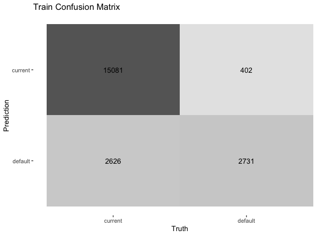<!-- --><!-- --><!-- -->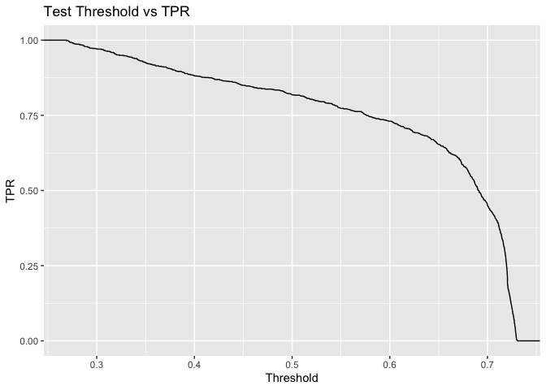<!-- --><!-- --><!-- -->

``` r
predict_and_eval(xgb_workflow_fit,"XGBoost")
```

    ## # A tibble: 2 × 6
    ##   .estimator part     accuracy   kap mn_log_loss roc_auc
    ##   <chr>      <chr>       <dbl> <dbl>       <dbl>   <dbl>
    ## 1 binary     training    0.981 0.927      0.0847   0.996
    ## 2 binary     testing     0.951 0.811      0.139    0.978
    ## # A tibble: 11 × 3
    ##      fpr threshold   tpr
    ##    <dbl>     <dbl> <dbl>
    ##  1  0        0.912 0    
    ##  2  0.01     0.742 0.382
    ##  3  0.02     0.568 0.667
    ##  4  0.03     0.455 0.804
    ##  5  0.04     0.371 0.87 
    ##  6  0.05     0.313 0.908
    ##  7  0.06     0.268 0.932
    ##  8  0.07     0.238 0.949
    ##  9  0.08     0.21  0.958
    ## 10  0.09     0.191 0.961
    ## 11  0.1      0.176 0.967
    ## # A tibble: 11 × 3
    ##    threshold   fpr   tpr
    ##        <dbl> <dbl> <dbl>
    ##  1       0.1 0.124 0.991
    ##  2       0.2 0.071 0.977
    ##  3       0.3 0.048 0.954
    ##  4       0.4 0.036 0.914
    ##  5       0.5 0.026 0.871
    ##  6       0.6 0.019 0.811
    ##  7       0.7 0.014 0.751
    ##  8       0.8 0.009 0.658
    ##  9       0.9 0.003 0.526
    ## 10       1   0     0.266
    ## 11     Inf   0     0    
    ## # A tibble: 11 × 3
    ##      tpr   fpr threshold
    ##    <dbl> <dbl>     <dbl>
    ##  1   0   0       Inf    
    ##  2   0.1 0         0.993
    ##  3   0.2 0.001     0.98 
    ##  4   0.3 0.002     0.956
    ##  5   0.4 0.004     0.923
    ##  6   0.5 0.007     0.882
    ##  7   0.6 0.01      0.835
    ##  8   0.7 0.014     0.757
    ##  9   0.8 0.019     0.65 
    ## 10   0.9 0.03      0.496
    ## 11   1   0.066     0.265
    ## # A tibble: 1 × 3
    ##   .metric   .estimator .estimate
    ##   <chr>     <chr>          <dbl>
    ## 1 precision binary         0.750
    ## # A tibble: 2 × 4
    ##   .metric   .estimator .estimate part    
    ##   <chr>     <chr>          <dbl> <chr>   
    ## 1 precision binary         0.912 training
    ## 2 precision binary         0.832 testing 
    ## # A tibble: 2 × 4
    ##   .metric .estimator .estimate part    
    ##   <chr>   <chr>          <dbl> <chr>   
    ## 1 recall  binary         0.966 training
    ## 2 recall  binary         0.847 testing

<!-- --><!-- --><!-- --><!-- --><!-- --><!-- --><!-- --><!-- -->

## XGBoost Model Buiding

Here we want to TUNE our XGB model using the Bayes method.

``` r
tune_recipe <- recipe(loan_status ~ term+total_rec_late_fee+last_pymnt_amnt+last_pymnt_d+loan_amnt,data = train) %>%
  step_unknown(all_nominal_predictors ()) %>% # replace category missing values
  step_nzv(all_nominal_predictors()) %>% 
  themis::step_downsample(loan_status, under_ratio = 3) %>% 
  step_impute_median(all_numeric_predictors()) %>% 
  step_dummy(all_nominal_predictors ())


xgb_model <- boost_tree(learn_rate = tune(),
                        tree_depth = tune()) %>%
  set_engine("xgboost",
             importance="permutation") %>%
  set_mode("classification")


xgb_wflow <-workflow() %>%
  add_recipe(tune_recipe) %>%
  add_model(xgb_model)


kfold_splits <- vfold_cv(train, v=3)

xgb_search_res <- xgb_wflow %>% 
  tune_bayes(
    resamples = kfold_splits,
    # Generate five at semi-random to start
    initial = 3,
    iter = 50, 
    # How to measure performance?
    metrics = metric_set(roc_auc),
    control = control_bayes(no_improve = 5, verbose = TRUE)
  )
```

    ## 

    ## ❯  Generating a set of 3 initial parameter results

    ## ✓ Initialization complete

    ## 

    ## 

    ## ── Iteration 1 ─────────────────────────────────────────────────────────────────

    ## 

    ## i Current best:      roc_auc=0.9002 (@iter 0)

    ## i Gaussian process model

    ## ! The Gaussian process model is being fit using 2 features but only has 3
    ##   data points to do so. This may cause errors or a poor model fit.

    ## ✓ Gaussian process model

    ## i Generating 5000 candidates

    ## i Predicted candidates

    ## i tree_depth=14, learn_rate=0.316

    ## i Estimating performance

    ## i Fold1: preprocessor 1/1

    ## ✓ Fold1: preprocessor 1/1

    ## i Fold1: preprocessor 1/1, model 1/1

    ## ✓ Fold1: preprocessor 1/1, model 1/1

    ## i Fold1: preprocessor 1/1, model 1/1 (predictions)

    ## i Fold2: preprocessor 1/1

    ## ✓ Fold2: preprocessor 1/1

    ## i Fold2: preprocessor 1/1, model 1/1

    ## ✓ Fold2: preprocessor 1/1, model 1/1

    ## i Fold2: preprocessor 1/1, model 1/1 (predictions)

    ## i Fold3: preprocessor 1/1

    ## ✓ Fold3: preprocessor 1/1

    ## i Fold3: preprocessor 1/1, model 1/1

    ## ✓ Fold3: preprocessor 1/1, model 1/1

    ## i Fold3: preprocessor 1/1, model 1/1 (predictions)

    ## ✓ Estimating performance

    ## ♥ Newest results:    roc_auc=0.9381 (+/-0.00366)

    ## 

    ## ── Iteration 2 ─────────────────────────────────────────────────────────────────

    ## 

    ## i Current best:      roc_auc=0.9381 (@iter 1)

    ## i Gaussian process model

    ## ✓ Gaussian process model

    ## i Generating 5000 candidates

    ## i Predicted candidates

    ## i tree_depth=15, learn_rate=0.302

    ## i Estimating performance

    ## i Fold1: preprocessor 1/1

    ## ✓ Fold1: preprocessor 1/1

    ## i Fold1: preprocessor 1/1, model 1/1

    ## ✓ Fold1: preprocessor 1/1, model 1/1

    ## i Fold1: preprocessor 1/1, model 1/1 (predictions)

    ## i Fold2: preprocessor 1/1

    ## ✓ Fold2: preprocessor 1/1

    ## i Fold2: preprocessor 1/1, model 1/1

    ## ✓ Fold2: preprocessor 1/1, model 1/1

    ## i Fold2: preprocessor 1/1, model 1/1 (predictions)

    ## i Fold3: preprocessor 1/1

    ## ✓ Fold3: preprocessor 1/1

    ## i Fold3: preprocessor 1/1, model 1/1

    ## ✓ Fold3: preprocessor 1/1, model 1/1

    ## i Fold3: preprocessor 1/1, model 1/1 (predictions)

    ## ✓ Estimating performance

    ## ♥ Newest results:    roc_auc=0.9395 (+/-0.00399)

    ## 

    ## ── Iteration 3 ─────────────────────────────────────────────────────────────────

    ## 

    ## i Current best:      roc_auc=0.9395 (@iter 2)

    ## i Gaussian process model

    ## ✓ Gaussian process model

    ## i Generating 5000 candidates

    ## i Predicted candidates

    ## i tree_depth=15, learn_rate=0.31

    ## i Estimating performance

    ## i Fold1: preprocessor 1/1

    ## ✓ Fold1: preprocessor 1/1

    ## i Fold1: preprocessor 1/1, model 1/1

    ## ✓ Fold1: preprocessor 1/1, model 1/1

    ## i Fold1: preprocessor 1/1, model 1/1 (predictions)

    ## i Fold2: preprocessor 1/1

    ## ✓ Fold2: preprocessor 1/1

    ## i Fold2: preprocessor 1/1, model 1/1

    ## ✓ Fold2: preprocessor 1/1, model 1/1

    ## i Fold2: preprocessor 1/1, model 1/1 (predictions)

    ## i Fold3: preprocessor 1/1

    ## ✓ Fold3: preprocessor 1/1

    ## i Fold3: preprocessor 1/1, model 1/1

    ## ✓ Fold3: preprocessor 1/1, model 1/1

    ## i Fold3: preprocessor 1/1, model 1/1 (predictions)

    ## ✓ Estimating performance

    ## ♥ Newest results:    roc_auc=0.9397 (+/-0.00395)

    ## 

    ## ── Iteration 4 ─────────────────────────────────────────────────────────────────

    ## 

    ## i Current best:      roc_auc=0.9397 (@iter 3)

    ## i Gaussian process model

    ## ✓ Gaussian process model

    ## i Generating 5000 candidates

    ## i Predicted candidates

    ## i tree_depth=15, learn_rate=0.197

    ## i Estimating performance

    ## i Fold1: preprocessor 1/1

    ## ✓ Fold1: preprocessor 1/1

    ## i Fold1: preprocessor 1/1, model 1/1

    ## ✓ Fold1: preprocessor 1/1, model 1/1

    ## i Fold1: preprocessor 1/1, model 1/1 (predictions)

    ## i Fold2: preprocessor 1/1

    ## ✓ Fold2: preprocessor 1/1

    ## i Fold2: preprocessor 1/1, model 1/1

    ## ✓ Fold2: preprocessor 1/1, model 1/1

    ## i Fold2: preprocessor 1/1, model 1/1 (predictions)

    ## i Fold3: preprocessor 1/1

    ## ✓ Fold3: preprocessor 1/1

    ## i Fold3: preprocessor 1/1, model 1/1

    ## ✓ Fold3: preprocessor 1/1, model 1/1

    ## i Fold3: preprocessor 1/1, model 1/1 (predictions)

    ## ✓ Estimating performance

    ## ⓧ Newest results:    roc_auc=0.9348 (+/-0.00438)

    ## 

    ## ── Iteration 5 ─────────────────────────────────────────────────────────────────

    ## 

    ## i Current best:      roc_auc=0.9397 (@iter 3)

    ## i Gaussian process model

    ## ✓ Gaussian process model

    ## i Generating 5000 candidates

    ## i Predicted candidates

    ## i tree_depth=12, learn_rate=0.311

    ## i Estimating performance

    ## i Fold1: preprocessor 1/1

    ## ✓ Fold1: preprocessor 1/1

    ## i Fold1: preprocessor 1/1, model 1/1

    ## ✓ Fold1: preprocessor 1/1, model 1/1

    ## i Fold1: preprocessor 1/1, model 1/1 (predictions)

    ## i Fold2: preprocessor 1/1

    ## ✓ Fold2: preprocessor 1/1

    ## i Fold2: preprocessor 1/1, model 1/1

    ## ✓ Fold2: preprocessor 1/1, model 1/1

    ## i Fold2: preprocessor 1/1, model 1/1 (predictions)

    ## i Fold3: preprocessor 1/1

    ## ✓ Fold3: preprocessor 1/1

    ## i Fold3: preprocessor 1/1, model 1/1

    ## ✓ Fold3: preprocessor 1/1, model 1/1

    ## i Fold3: preprocessor 1/1, model 1/1 (predictions)

    ## ✓ Estimating performance

    ## ⓧ Newest results:    roc_auc=0.9343 (+/-0.00415)

    ## 

    ## ── Iteration 6 ─────────────────────────────────────────────────────────────────

    ## 

    ## i Current best:      roc_auc=0.9397 (@iter 3)

    ## i Gaussian process model

    ## ✓ Gaussian process model

    ## i Generating 5000 candidates

    ## i Predicted candidates

    ## i tree_depth=15, learn_rate=0.00104

    ## i Estimating performance

    ## i Fold1: preprocessor 1/1

    ## ✓ Fold1: preprocessor 1/1

    ## i Fold1: preprocessor 1/1, model 1/1

    ## ✓ Fold1: preprocessor 1/1, model 1/1

    ## i Fold1: preprocessor 1/1, model 1/1 (predictions)

    ## i Fold2: preprocessor 1/1

    ## ✓ Fold2: preprocessor 1/1

    ## i Fold2: preprocessor 1/1, model 1/1

    ## ✓ Fold2: preprocessor 1/1, model 1/1

    ## i Fold2: preprocessor 1/1, model 1/1 (predictions)

    ## i Fold3: preprocessor 1/1

    ## ✓ Fold3: preprocessor 1/1

    ## i Fold3: preprocessor 1/1, model 1/1

    ## ✓ Fold3: preprocessor 1/1, model 1/1

    ## i Fold3: preprocessor 1/1, model 1/1 (predictions)

    ## ✓ Estimating performance

    ## ⓧ Newest results:    roc_auc=0.8932 (+/-0.00561)

    ## 

    ## ── Iteration 7 ─────────────────────────────────────────────────────────────────

    ## 

    ## i Current best:      roc_auc=0.9397 (@iter 3)

    ## i Gaussian process model

    ## ✓ Gaussian process model

    ## i Generating 5000 candidates

    ## i Predicted candidates

    ## i tree_depth=1, learn_rate=0.306

    ## i Estimating performance

    ## i Fold1: preprocessor 1/1

    ## ✓ Fold1: preprocessor 1/1

    ## i Fold1: preprocessor 1/1, model 1/1

    ## ✓ Fold1: preprocessor 1/1, model 1/1

    ## i Fold1: preprocessor 1/1, model 1/1 (predictions)

    ## i Fold2: preprocessor 1/1

    ## ✓ Fold2: preprocessor 1/1

    ## i Fold2: preprocessor 1/1, model 1/1

    ## ✓ Fold2: preprocessor 1/1, model 1/1

    ## i Fold2: preprocessor 1/1, model 1/1 (predictions)

    ## i Fold3: preprocessor 1/1

    ## ✓ Fold3: preprocessor 1/1

    ## i Fold3: preprocessor 1/1, model 1/1

    ## ✓ Fold3: preprocessor 1/1, model 1/1

    ## i Fold3: preprocessor 1/1, model 1/1 (predictions)

    ## ✓ Estimating performance

    ## ⓧ Newest results:    roc_auc=0.8134 (+/-0.0027)

    ## 

    ## ── Iteration 8 ─────────────────────────────────────────────────────────────────

    ## 

    ## i Current best:      roc_auc=0.9397 (@iter 3)

    ## i Gaussian process model

    ## ✓ Gaussian process model

    ## i Generating 5000 candidates

    ## i Predicted candidates

    ## i tree_depth=9, learn_rate=0.312

    ## i Estimating performance

    ## i Fold1: preprocessor 1/1

    ## ✓ Fold1: preprocessor 1/1

    ## i Fold1: preprocessor 1/1, model 1/1

    ## ✓ Fold1: preprocessor 1/1, model 1/1

    ## i Fold1: preprocessor 1/1, model 1/1 (predictions)

    ## i Fold2: preprocessor 1/1

    ## ✓ Fold2: preprocessor 1/1

    ## i Fold2: preprocessor 1/1, model 1/1

    ## ✓ Fold2: preprocessor 1/1, model 1/1

    ## i Fold2: preprocessor 1/1, model 1/1 (predictions)

    ## i Fold3: preprocessor 1/1

    ## ✓ Fold3: preprocessor 1/1

    ## i Fold3: preprocessor 1/1, model 1/1

    ## ✓ Fold3: preprocessor 1/1, model 1/1

    ## i Fold3: preprocessor 1/1, model 1/1 (predictions)

    ## ✓ Estimating performance

    ## ⓧ Newest results:    roc_auc=0.9267 (+/-0.00616)

    ## ! No improvement for 5 iterations; returning current results.

## XGB Tuning

Evaluate the tuning efforts

``` r
# Experiments 
xgb_search_res %>%
  collect_metrics()  %>% 
  filter(.metric == "roc_auc")
```

    ## # A tibble: 11 × 9
    ##    tree_depth learn_rate .metric .estimator  mean     n std_err .config    .iter
    ##         <int>      <dbl> <chr>   <chr>      <dbl> <int>   <dbl> <chr>      <int>
    ##  1         11    0.0344  roc_auc binary     0.900     3 0.00602 Preproces…     0
    ##  2          6    0.0855  roc_auc binary     0.890     3 0.00458 Preproces…     0
    ##  3          2    0.00178 roc_auc binary     0.786     3 0.00158 Preproces…     0
    ##  4         14    0.316   roc_auc binary     0.938     3 0.00366 Iter1          1
    ##  5         15    0.302   roc_auc binary     0.940     3 0.00399 Iter2          2
    ##  6         15    0.310   roc_auc binary     0.940     3 0.00395 Iter3          3
    ##  7         15    0.197   roc_auc binary     0.935     3 0.00438 Iter4          4
    ##  8         12    0.311   roc_auc binary     0.934     3 0.00415 Iter5          5
    ##  9         15    0.00104 roc_auc binary     0.893     3 0.00561 Iter6          6
    ## 10          1    0.306   roc_auc binary     0.813     3 0.00270 Iter7          7
    ## 11          9    0.312   roc_auc binary     0.927     3 0.00616 Iter8          8

``` r
# Graph of learning rate 
xgb_search_res %>%
  collect_metrics() %>%
  ggplot(aes(learn_rate, mean, color = .metric)) +
  geom_errorbar(aes(
    ymin = mean - std_err,
    ymax = mean + std_err
  ),
  alpha = 0.5
  ) +
  geom_line(size = 1.5) +
  facet_wrap(~.metric, scales = "free", nrow = 2) +
  scale_x_log10() +
  theme(legend.position = "none") + labs(title="XGBoost Learn Rate Tuning Performance")
```

<!-- -->

``` r
# graph of tree depth 
xgb_search_res %>%
  collect_metrics() %>%
  ggplot(aes(tree_depth, mean, color = .metric)) +
  geom_errorbar(aes(
    ymin = mean - std_err,
    ymax = mean + std_err
  ),
  alpha = 0.5
  ) +
  geom_line(size = 1.5) +
  facet_wrap(~.metric, scales = "free", nrow = 2) +
  scale_x_log10() +
  theme(legend.position = "none") + labs(title="XGBoost Tree Depth Tuning Performance")
```

<!-- -->

## Final Fit RF and XGB

Finally fit the XGB model using the best set of parameters

``` r
lowest_xgb_auc <- xgb_search_res %>%
  select_best("roc_auc")

lowest_xgb_auc
```

    ## # A tibble: 1 × 3
    ##   tree_depth learn_rate .config
    ##        <int>      <dbl> <chr>  
    ## 1         15      0.310 Iter3

``` r
xgb_wflow <- finalize_workflow(
  xgb_wflow, lowest_xgb_auc
) %>% 
  fit(train)
```

    ## [17:37:07] WARNING: amalgamation/../src/learner.cc:627: 
    ## Parameters: { "importance" } might not be used.
    ## 
    ##   This could be a false alarm, with some parameters getting used by language bindings but
    ##   then being mistakenly passed down to XGBoost core, or some parameter actually being used
    ##   but getting flagged wrongly here. Please open an issue if you find any such cases.

``` r
predict_and_eval(xgb_wflow,"Tuned XGBoost")
```

    ## # A tibble: 2 × 6
    ##   .estimator part     accuracy   kap mn_log_loss roc_auc
    ##   <chr>      <chr>       <dbl> <dbl>       <dbl>   <dbl>
    ## 1 binary     training    0.938 0.743       0.195   0.968
    ## 2 binary     testing     0.916 0.645       0.223   0.943
    ## # A tibble: 11 × 3
    ##      fpr threshold   tpr
    ##    <dbl>     <dbl> <dbl>
    ##  1  0        0.824 0    
    ##  2  0.01     0.667 0.362
    ##  3  0.02     0.561 0.513
    ##  4  0.03     0.498 0.591
    ##  5  0.04     0.448 0.637
    ##  6  0.05     0.421 0.678
    ##  7  0.06     0.396 0.708
    ##  8  0.07     0.39  0.74 
    ##  9  0.08     0.374 0.754
    ## 10  0.09     0.356 0.778
    ## 11  0.1      0.339 0.794
    ## # A tibble: 11 × 3
    ##    threshold   fpr   tpr
    ##        <dbl> <dbl> <dbl>
    ##  1       0.1 0.31  0.99 
    ##  2       0.2 0.212 0.974
    ##  3       0.3 0.098 0.937
    ##  4       0.4 0.045 0.795
    ##  5       0.5 0.026 0.676
    ##  6       0.6 0.016 0.597
    ##  7       0.7 0.009 0.523
    ##  8       0.8 0.002 0.455
    ##  9       0.9 0     0.266
    ## 10       1   0     0.013
    ## 11     Inf   0     0    
    ## # A tibble: 11 × 3
    ##      tpr   fpr threshold
    ##    <dbl> <dbl>     <dbl>
    ##  1   0   0       Inf    
    ##  2   0.1 0         0.931
    ##  3   0.2 0.001     0.898
    ##  4   0.3 0.002     0.857
    ##  5   0.4 0.005     0.824
    ##  6   0.5 0.009     0.753
    ##  7   0.6 0.019     0.603
    ##  8   0.7 0.04      0.476
    ##  9   0.8 0.073     0.393
    ## 10   0.9 0.134     0.331
    ## 11   1   0.226     0.233
    ## # A tibble: 1 × 3
    ##   .metric   .estimator .estimate
    ##   <chr>     <chr>          <dbl>
    ## 1 precision binary         0.505
    ## # A tibble: 2 × 4
    ##   .metric   .estimator .estimate part    
    ##   <chr>     <chr>          <dbl> <chr>   
    ## 1 precision binary         0.849 training
    ## 2 precision binary         0.765 testing 
    ## # A tibble: 2 × 4
    ##   .metric .estimator .estimate part    
    ##   <chr>   <chr>          <dbl> <chr>   
    ## 1 recall  binary         0.718 training
    ## 2 recall  binary         0.635 testing

<!-- --><!-- --><!-- --><!-- --><!-- --><!-- -->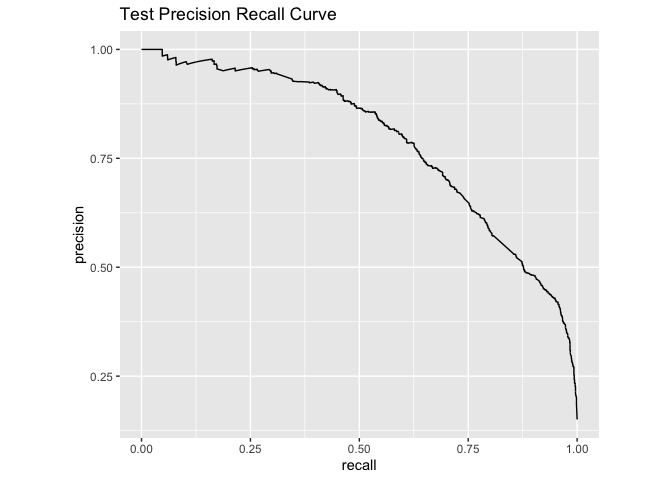<!-- --><!-- -->

# PDP and Partial Variable Dependence Plots

## Global Interpretations

``` r
library(DALEXtra)
```

    ## Loading required package: DALEX

    ## Welcome to DALEX (version: 2.4.2).
    ## Find examples and detailed introduction at: http://ema.drwhy.ai/

    ## 
    ## Attaching package: 'DALEX'

    ## The following object is masked from 'package:dplyr':
    ## 
    ##     explain

``` r
xgb_explainer <- explain_tidymodels(
  xgb_workflow_fit,
  data = dplyr::select(train, -loan_status),
  y = train$loan_status ,
  verbose = FALSE
)
```

    ## Warning in Ops.factor(y, predict_function(model, data)): '-' not meaningful for
    ## factors

``` r
for (i in c("last_pymnt_amnt","term","total_rec_late_fee","loan_amnt","fico_range_low","annual_inc","inq_last_6mths")) {
  pdp_plot <- model_profile(  xgb_explainer,variables = c(i))

  print(plot(pdp_plot) + 
  labs(title = paste("PDP: How does", i,"impact predictions (on average)"),
       x=i,
       y="average impact on prediction"))
}
```

    ## 'variable_type' changed to 'categorical' due to lack of numerical variables.

<!-- -->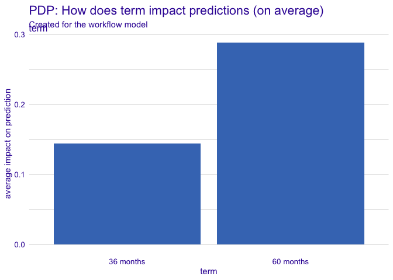<!-- --><!-- -->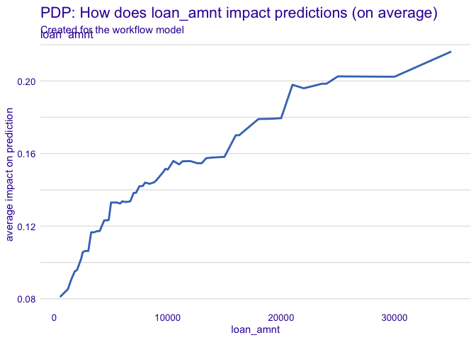<!-- --><!-- --><!-- --><!-- -->

## Make a Function

``` r
loan_sample <- train %>% sample_n(1000)
loans_explainer <- explain_tidymodels(
    xgb_workflow_fit,   # fitted workflow object 
    data = loan_sample,    # original training data
    y = loan_sample$loan_status, # predicted outcome 
    label = "xgboost",
    verbose = FALSE
  )
```

    ## Warning in Ops.factor(y, predict_function(model, data)): '-' not meaningful for
    ## factors

``` r
explain_prediction <- function(single_record){
  # step 3. run the explainer 
record_shap <- predict_parts(explainer = xgb_explainer, 
                               new_observation = single_record,
                               #type="shap"
                             )

# step 4. plot it. 
# you notice you don't get categorical values ...  
record_shap %>% plot() %>% print()

# --- more involved explanations with categories. ---- 

# step 4a.. convert breakdown to a tibble so we can join it
record_shap %>%
  as_tibble() -> shap_data 

# step 4b. transpose your single record prediction 
single_record %>% 
 gather(key="variable_name",value="value") -> prediction_data 

# step 4c. get a predicted probability for plot 
prediction_prob <- single_record[,".pred_default"] %>% mutate(.pred_default = round(.pred_default,3)) %>% pull() 

# step 5. plot it.
shap_data %>% 
  inner_join(prediction_data) %>%
  mutate(variable = paste(variable_name,value,sep = ": ")) %>% 
  group_by(variable) %>%
  summarize(contribution = mean(contribution)) %>%
  mutate(contribution = round(contribution,3),
         sign = if_else(contribution < 0, "neg","pos")) %>%
  ggplot(aes(y=reorder(variable, contribution), x= contribution, fill=sign)) +
  geom_col() + 
  geom_text(aes(label=contribution))+
  labs(
    title = "SHAPLEY explainations",
    subtitle = paste("predicted probablity = ",prediction_prob) ,
                    x="contribution",
                    y="features")
  
}

 # -- score training 
scored_train <- predict(xgb_workflow_fit, train, type="prob") %>%
  bind_cols(predict(xgb_workflow_fit, train, type="class")) %>%
  bind_cols(.,train) 

# -- score testing 
scored_test <- predict(xgb_workflow_fit, test, type="prob") %>%
  bind_cols(predict(xgb_workflow_fit, test, type="class")) %>%
  bind_cols(.,test)
  
  
top_5_tp <- scored_test %>%
  filter(.pred_class == loan_status) %>%
  filter(loan_status == "default") %>%
  slice_max(.pred_default,n=10)

top_5_fp <- scored_test %>%
  filter(.pred_class != loan_status) %>%
  filter(loan_status == "current") %>%
  slice_max(.pred_default,n=10)

top_5_fn <- scored_test %>%
  filter(.pred_class != loan_status ) %>%
  filter(loan_status == "default") %>%
  slice_max(.pred_default,n=10)


# repeat for FP and FN 
for (row in 1:nrow(top_5_tp)) {
    s_record <- top_5_tp[row,]
    explain_prediction(s_record)
} 
```

    ## Warning: attributes are not identical across measure variables;
    ## they will be dropped

    ## Joining, by = "variable_name"

<!-- -->

    ## Warning: attributes are not identical across measure variables;
    ## they will be dropped

    ## Joining, by = "variable_name"

<!-- -->

    ## Warning: attributes are not identical across measure variables;
    ## they will be dropped

    ## Joining, by = "variable_name"

<!-- -->

    ## Warning: attributes are not identical across measure variables;
    ## they will be dropped

    ## Joining, by = "variable_name"

<!-- -->

    ## Warning: attributes are not identical across measure variables;
    ## they will be dropped

    ## Joining, by = "variable_name"

<!-- -->

    ## Warning: attributes are not identical across measure variables;
    ## they will be dropped

    ## Joining, by = "variable_name"

<!-- -->

    ## Warning: attributes are not identical across measure variables;
    ## they will be dropped

    ## Joining, by = "variable_name"

<!-- -->

    ## Warning: attributes are not identical across measure variables;
    ## they will be dropped

    ## Joining, by = "variable_name"

<!-- -->

    ## Warning: attributes are not identical across measure variables;
    ## they will be dropped

    ## Joining, by = "variable_name"

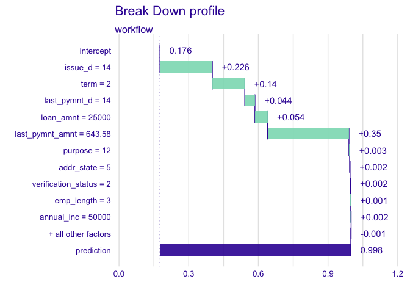<!-- -->

    ## Warning: attributes are not identical across measure variables;
    ## they will be dropped

    ## Joining, by = "variable_name"

<!-- -->

``` r
for (row in 1:nrow(top_5_fp)) {
    s_record <- top_5_fp[row,]
    explain_prediction(s_record)
} 
```

    ## Warning: attributes are not identical across measure variables;
    ## they will be dropped

    ## Joining, by = "variable_name"

<!-- -->

    ## Warning: attributes are not identical across measure variables;
    ## they will be dropped

    ## Joining, by = "variable_name"

<!-- -->

    ## Warning: attributes are not identical across measure variables;
    ## they will be dropped

    ## Joining, by = "variable_name"

<!-- -->

    ## Warning: attributes are not identical across measure variables;
    ## they will be dropped

    ## Joining, by = "variable_name"

<!-- -->

    ## Warning: attributes are not identical across measure variables;
    ## they will be dropped

    ## Joining, by = "variable_name"

<!-- -->

    ## Warning: attributes are not identical across measure variables;
    ## they will be dropped

    ## Joining, by = "variable_name"

<!-- -->

    ## Warning: attributes are not identical across measure variables;
    ## they will be dropped

    ## Joining, by = "variable_name"

<!-- -->

    ## Warning: attributes are not identical across measure variables;
    ## they will be dropped

    ## Joining, by = "variable_name"

<!-- -->

    ## Warning: attributes are not identical across measure variables;
    ## they will be dropped

    ## Joining, by = "variable_name"

<!-- -->

    ## Warning: attributes are not identical across measure variables;
    ## they will be dropped

    ## Joining, by = "variable_name"

<!-- -->

``` r
for (row in 1:nrow(top_5_fn)) {
    s_record <- top_5_fn[row,]
    explain_prediction(s_record)
} 
```

    ## Warning: attributes are not identical across measure variables;
    ## they will be dropped

    ## Joining, by = "variable_name"

<!-- -->

    ## Warning: attributes are not identical across measure variables;
    ## they will be dropped

    ## Joining, by = "variable_name"

<!-- -->

    ## Warning: attributes are not identical across measure variables;
    ## they will be dropped

    ## Joining, by = "variable_name"

<!-- -->

    ## Warning: attributes are not identical across measure variables;
    ## they will be dropped

    ## Joining, by = "variable_name"

<!-- -->

    ## Warning: attributes are not identical across measure variables;
    ## they will be dropped

    ## Joining, by = "variable_name"

<!-- -->

    ## Warning: attributes are not identical across measure variables;
    ## they will be dropped

    ## Joining, by = "variable_name"

<!-- -->

    ## Warning: attributes are not identical across measure variables;
    ## they will be dropped

    ## Joining, by = "variable_name"

<!-- -->

    ## Warning: attributes are not identical across measure variables;
    ## they will be dropped

    ## Joining, by = "variable_name"

<!-- -->

    ## Warning: attributes are not identical across measure variables;
    ## they will be dropped

    ## Joining, by = "variable_name"

<!-- -->

    ## Warning: attributes are not identical across measure variables;
    ## they will be dropped

    ## Joining, by = "variable_name"

<!-- -->

# Holdout set

``` r
loan_ho <- loan_ho %>% 
  mutate(int_rate = as.numeric(substring(int_rate,1,nchar(int_rate)-1))) %>%
  mutate(revol_util = as.numeric(substring(int_rate,1,nchar(revol_util)-1))) %>%
  mutate_if(is.character,factor)

# -- score testing 
loan_ho <- predict(xgb_workflow_fit,loan_ho, type = "prob") %>%
  bind_cols(., loan_ho) %>%
  dplyr::select(id, EVENT_LABEL = .pred_default)
```

    ## Warning: Novel levels found in column 'earliest_cr_line': 'Dec-1963',
    ## 'Feb-1966', 'Jan-1972', 'Jun-1959', 'Jun-1967', 'Jun-1968', 'Mar-1968',
    ## 'Nov-1954', 'Nov-1959', 'Nov-1961', 'Nov-1965', 'Oct-1967', 'Oct-1970',
    ## 'Oct-1975'. The levels have been removed, and values have been coerced to 'NA'.

    ## Warning: Novel levels found in column 'next_pymnt_d': 'Apr-2014', 'Dec-2007',
    ## 'May-2008', 'Sep-2008', 'Sep-2016'. The levels have been removed, and values
    ## have been coerced to 'NA'.

    ## Warning: Novel levels found in column 'last_credit_pull_d': 'Feb-2008',
    ## 'May-2008'. The levels have been removed, and values have been coerced to 'NA'.

``` r
loan_ho %>%
  write_csv("my_kaggle_submission_2.csv")
```
